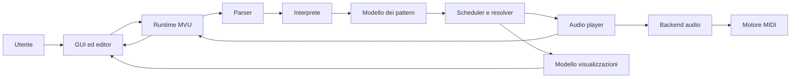

# Architettura

## Vista d'insieme

L'architettura separa la traduzione del testo, la semantica temporale, l'esecuzione e la presentazione. Il dato attraversa il sistema in una direzione principale: testo → AST → pattern → eventi schedulati → payload audio. Stato ed errori tornano alla vista attraverso il runtime MVU.

## Componenti e responsabilità

| Componente | Responsabilità | Input / output principali |
|---|---|---|
| GUI ed editor | Acquisisce il programma, espone comandi, mostra errori e highlight. | Testo e gesti / messaggi utente, stato renderizzato. |
| Runtime MVU | Possiede `AppModel`, serializza i messaggi ed esegue comandi con effetti. | `Msg` / nuovo modello e `Cmd`. |
| Parser | Valida la grammatica e conserva coordinate sorgente. | Stringa / `ProgramAST` oppure errore formattato. |
| Interprete | Traduce l'AST sintattico nel modello semantico. | `ProgramAST` / lista di `Pattern[AudioPayload]`. |
| Dominio | Definisce frazioni, intervalli, pattern, modificatori, payload ed eventi. | Strutture immutabili senza dipendenze infrastrutturali. |
| Resolver dei pattern | Proietta ricorsivamente un pattern su una finestra temporale. | Pattern + intervallo / eventi logici. |
| Scheduler | Costruisce timeline finite per le viste e lazy per la riproduzione. | Lista di pattern / sequenze o `LazyList` di eventi. |
| Audio player | Governa ciclo di esecuzione, tempo assoluto, sostituzione timeline e notifiche. | Eventi schedulati / invocazioni backend e posizioni evidenziate. |
| Backend audio | Traduce payload ed effetti in comandi audio. | `AudioPayload`, durata, estensioni / chiamate al motore. |
| Motore MIDI | Riproduce note e percussioni General MIDI; gestisce indisponibilità. | Note/programmi/velocity / output del sintetizzatore locale. |
| Visualizzazioni | Proiettano eventi su piano roll/oscilloscopio e gestiscono animazione. | Timeline e stato play/stop / nodi JavaFX. |

## Interazioni principali

### Play e update

1. La GUI invia il testo al runtime.
2. Il parser produce l'AST o un errore posizionale.
3. L'interprete costruisce pattern di dominio.
4. Lo scheduler genera la timeline lazy per il player e una vista finita quando necessaria.
5. Il player converte la fase logica tramite `Tempo`, invoca il backend e notifica le posizioni testuali.
6. Il runtime aggiorna il modello; la GUI evidenzia eventi e stato.

### Errore

Il fallimento del parsing non attraversa interprete e scheduler. È trasformato in stato di errore per la GUI. Durante un update, la timeline valida già in esecuzione deve restare attiva, come richiesto da RNF-04.

## Scelte e motivazioni

Le strutture immutabili e la risoluzione tramite funzioni pure rispondono a RNF-01 e RNF-07. Il tempo razionale evita accumulo di errore nella composizione annidata. La `LazyList` soddisfa RNF-06 perché una musica ciclica non richiede di materializzare una sequenza infinita. Le porte `AudioBackend` e `AudioEngine` isolano hardware e Java Sound, rendendo verificabili scheduler e player anche senza MIDI (RF-23, RNF-07). MVU concentra le transizioni di stato e riduce aggiornamenti UI non coordinati (RF-03, RF-17, RNF-04).

ScalaFX/RichTextFX e Java MIDI sono scelte di implementazione adatte a un'app desktop JVM; non contaminano il dominio. Le alternative browser/WebAudio o SuperCollider avrebbero ampliato portabilità o sintesi, ma anche introdotto distribuzione, protocolli o runtime aggiuntivi non richiesti.

## Concorrenza e guasti

JavaFX impone gli aggiornamenti grafici sul proprio application thread; il player gestisce il tempo senza affidare la continuità audio al rendering. Le callback verso la GUI devono quindi essere inoltrate in modo sicuro al thread JavaFX. Il backend no-op permette l'avvio senza sintetizzatore MIDI. Errori di input sono valori gestiti; eccezioni infrastrutturali devono essere contenute al confine del backend e rese osservabili. Le soglie di reattività e jitter restano oggetto di misura secondo RNF-02 e RNF-03.

