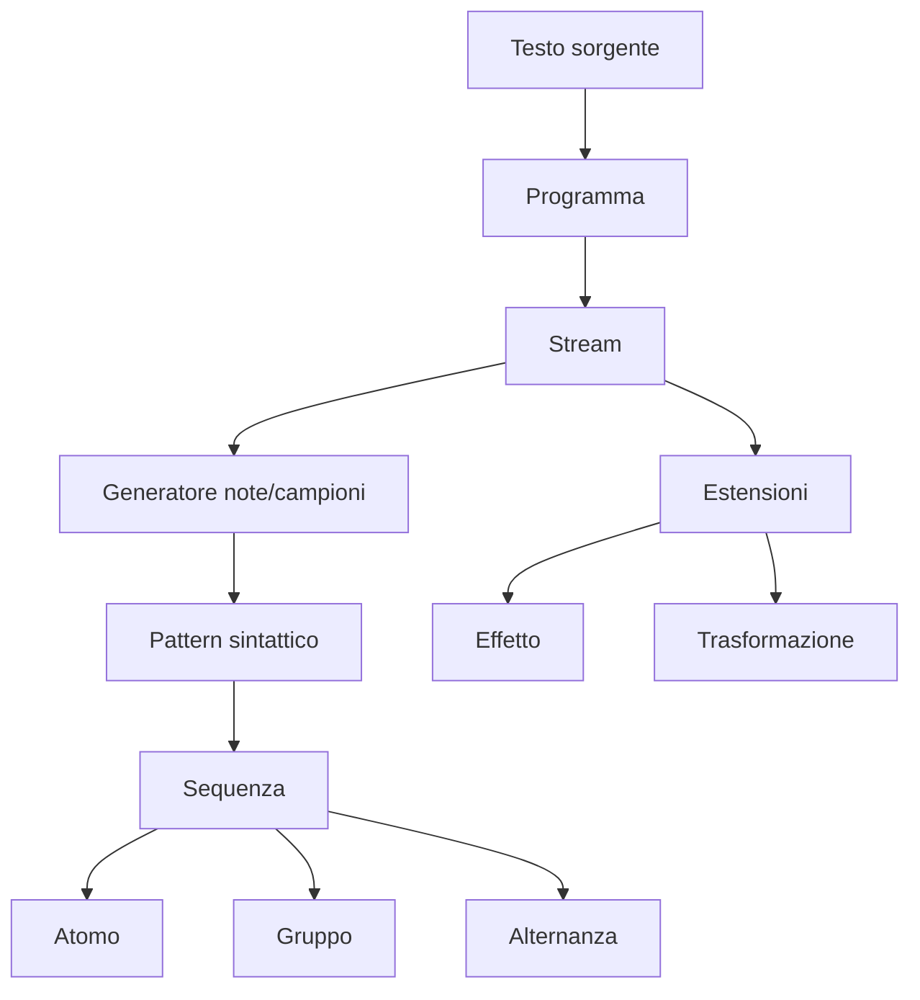

# Design di dettaglio

Questa sezione dettaglia i componenti architetturali senza riprodurre diagrammi completi estratti dal codice. I nomi identificano concetti stabili; classi e file concreti sono documentati nella sezione di implementazione.

## Pipeline del linguaggio

Il parser costruisce un AST distinto dal modello di dominio. Questa separazione permette di rappresentare fedelmente elementi sintattici e posizioni sorgente, mentre l'interprete elimina dettagli grammaticali e produce pattern eseguibili.

Ogni nota, campione, configurazione o silenzio conserva gli indici nel testo. L'interprete converte note e campioni in `AudioPayload`, trasforma la struttura sintattica in combinatori di `Pattern` e associa effetti o trasformazioni con tipi distinti. Un errore sintattico è prodotto prima dell'interpretazione; un valore riconosciuto grammaticalmente ma non valido deve generare un errore semantico esplicito.

## Algebra dei pattern

`Pattern[T]` è un tipo ricorsivo con i seguenti casi concettuali:

- `Atom`: un valore indivisibile;
- `Sequence`: figli che si dividono l'intervallo del genitore;
- `Parallel`: figli valutati sullo stesso intervallo;
- `Alternation`: un figlio scelto in base al ciclo;
- `WithExtensions`: pattern base con pattern di parametri/effetti;
- `TimeWarp`: pattern associato a un modificatore temporale.

La covarianza consente di comporre payload specializzati. I resolver sono separati per costrutto e restituiscono una lista di eventi contenuti o intersecati con la finestra richiesta. Questa soluzione rende ogni legge temporale verificabile isolatamente.

## Tempo e scheduling

Il dominio usa `Fraction` e `Interval` per il tempo musicale. `ScheduledEvent` conserva:

- `whole`, intervallo ideale dell'evento;
- `part`, porzione visibile nella finestra interrogata;
- `value`, payload;
- `appliedExtensions`, effetti risultanti.

Lo scheduler offre due proiezioni: timeline finite per test e visualizzazioni, timeline lazy per il player. `Tempo` converte soltanto al confine dell'esecuzione la fase razionale in offset e durata in millisecondi. Il player possiede lo stato running, la timeline corrente e la fase; `updateTimeline` sostituisce la sorgente secondo la politica del confine di ciclo.

## Audio

`AudioBackend` riceve payload già risolti e non conosce parser o GUI. Il backend MIDI distingue note melodiche e campioni percussivi, mappa nomi di strumenti sui programmi General MIDI e nomi di drum sui numeri MIDI. `AudioEngine` incapsula apertura, uso e chiusura del sintetizzatore. Una implementazione no-op rappresenta esplicitamente l'assenza del dispositivo e consente degradazione controllata e test.

Effetti non rappresentabili dal backend corrente non devono essere ignorati ambiguamente: la release finale deve documentare per ciascun effetto se è applicato, approssimato o rifiutato.

## Stato e interfaccia

Il pattern Model–View–Update usa:

- `AppModel` come stato osservabile dell'applicazione;
- `Msg` come insieme chiuso di eventi;
- `Update` come funzione di transizione che restituisce modello e comando;
- `Cmd` come descrizione degli effetti, inclusi parsing e controllo audio;
- `SoundCodeRuntime` come coordinatore e dispatcher.

La vista principale compone editor, banner di errore e visualizzazioni. L'editor incapsula syntax highlighting, autocompletamento, auto-pairing, zoom e numeri di riga. Le visualizzazioni implementano un piccolo contratto `play`/`stop`, così il runtime non dipende dal dettaglio grafico.

## Decisioni da validare prima della consegna

- Definire formalmente la semantica di update al confine di ciclo e verificarla con un test temporale.
- Allineare l'elenco degli effetti dichiarati nella DSL a quelli realmente gestiti dal backend.
- Stabilire se l'oscilloscopio rappresenta audio reale o una forma derivata dal modello; la relazione finale deve usare la definizione corretta.
- Eseguire benchmark di carico e jitter sui programmi di riferimento dei requisiti non funzionali.

