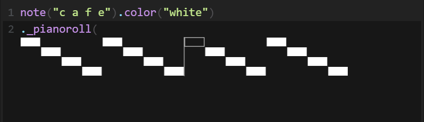

## 1. Scopo e criteri di successo

**BR-01 — Scopo.** SoundCode deve fornire un ambiente desktop di live coding musicale nel quale l'utente possa scrivere una mini-DSL testuale, convertirla in pattern temporali ciclici e riprodurla tramite il sintetizzatore MIDI locale.

**BR-02 — Risultato atteso.** Il sistema deve consentire almeno di comporre pattern di note e percussioni, combinarli in sequenza o in parallelo, alternarli fra cicli, trasformarne il tempo, aggiornare il programma durante una sessione e osservare la riproduzione nell'editor e nel piano roll.

**BR-03 — Criterio di successo.** Il progetto è considerato riuscito quando tutti i requisiti obbligatori di questa specifica sono dimostrabili sulla build di consegna mediante test automatici o scenari manuali ripetibili, senza richiedere la lettura del codice sorgente per determinarne il comportamento.

**BR-04 — Vincolo temporale.** Il progetto deve essere realizzato entro il periodo di due mesi assegnato.

## 2. Confini del sistema

SoundCode è un'applicazione desktop locale. Non è un sistema distribuito e non condivide sessioni, audio o stato attraverso la rete.

Sono compresi nel prodotto:

- editor multiriga con assistenza alla scrittura;
- parsing e interpretazione della DSL descritta in questo documento;
- rappresentazione funzionale e risoluzione temporale dei pattern;
- scheduling ciclico;
- riproduzione di note e percussioni tramite General MIDI;
- selezione dello strumento per le note;
- evidenziazione degli elementi in riproduzione;
- visualizzazione opzionale di uno stream tramite piano roll.

Non fanno parte della versione descritta:

- compatibilità completa con Strudel o TidalCycles;
- salvataggio e caricamento di file di progetto;
- esportazione MIDI, audio o JSON;
- modifica del tempo dalla GUI;
- campioni audio registrati esternamente;
- collaborazione remota;
- oscilloscopio richiamabile dalla DSL;
- sintesi audio continua configurabile dall'utente;
- resa sonora degli effetti `delay` e `hpf` nel backend MIDI corrente.

`gain`, `pan`, `room` e `lpf` sono invece resi udibili dal backend MIDI (rispettivamente tramite velocity e Control Change), mentre `delay` e `hpf` appartengono alla sintassi e al modello dei pattern ma restano metadati non tradotti in comandi udibili. La distinzione è specificata in RF-19 e RF-26.

## 3. Glossario e concetti di dominio

- **Programma:** uno o più stream separati da una o più interruzioni di riga.
- **Stream:** una sorgente `sound(...)` o `note(...)`, seguita da zero o più estensioni e, opzionalmente, da `_pianoroll()`.
- **Pattern:** struttura ricorsiva che descrive atomi, sequenze, parallelismi, alternanze e trasformazioni.
- **Atomo:** elemento indivisibile della Mini Notation: nota, identificatore di percussione, numero di configurazione o silenzio.
- **Ciclo:** unità temporale logica `[c,c+1)`. Nella configurazione corrente `cps = 0.5`, quindi un ciclo dura 2 secondi.
- **Sequenza:** insieme ordinato di elementi che si dividono in parti uguali l'intervallo assegnato.
- **Parallelo:** insieme di pattern valutati sul medesimo intervallo.
- **Alternanza:** scelta ciclica di un elemento diverso a ogni ciclo.
- **Evento:** payload sonoro associato a un intervallo temporale ideale e alla sua eventuale porzione visibile nella finestra corrente.
- **Estensione:** generatore o effetto concatenato a uno stream mediante `.`.
- **Trasformazione temporale:** operatore che modifica posizione, durata, ordine o numero degli eventi.
- **Posizione sorgente:** coppia di indici, inizio incluso e fine esclusa, che individua un atomo nel testo dell'editor.
- **Timeline:** sequenza ordinata di eventi ottenuta risolvendo uno o più pattern.

## 4. Attore e casi d'uso

L'attore primario è il musicista/programmatore. Il sintetizzatore General MIDI del sistema operativo è una dipendenza esterna locale.

### UC-01 — Aggiornare il programma

1. L'utente modifica il testo nell'editor.
2. L'utente preme **Update** o `Ctrl+U`.
3. Il sistema analizza l'intero testo.
4. Se il testo è valido, il sistema costruisce nuove timeline, sostituisce immediatamente quella audio e riporta la nuova fase all'inizio.
5. Se il testo non è valido, il sistema mostra l'errore e conserva la timeline valida precedente.

### UC-02 — Avviare e arrestare la riproduzione

1. L'utente carica una timeline valida tramite Update oppure usa quella caricata automaticamente all'avvio.
2. L'utente preme **Play** o `Ctrl+Enter`.
3. Il sistema avvia il loop audio, gli highlight e le visualizzazioni sulla timeline caricata. Soltanto Update azzera la fase della timeline audio.
4. L'utente preme **Stop** o `Ctrl+.`.
5. Il sistema impedisce l'avvio di nuovi eventi e rimuove gli highlight. Le note già inviate al sintetizzatore completano il proprio `noteOff` pianificato.

Play non analizza automaticamente il contenuto corrente dell'editor. Per rendere effettiva una modifica è necessario usare Update. Stop non ricostruisce né riavvolge la timeline: un successivo Play senza Update riutilizza la timeline residua e il riferimento temporale esistenti.

### UC-03 — Correggere un errore

1. L'utente richiede Update con un programma non valido.
2. Il sistema mostra riga, colonna, elemento atteso, riga sorgente e indicatore `^`.
3. L'applicazione rimane utilizzabile e l'eventuale riproduzione precedente non viene sostituita.
4. L'utente modifica il testo e richiede nuovamente Update.

## 5. Specifica lessicale e grammaticale della DSL

La grammatica seguente è normativa. Gli spazi indicati con `ws` sono zero o più spazi o tab; `newline` è `\n`. Le parentesi e le virgolette sono caratteri letterali.

```ebnf
program       = stream, { newline, { newline }, stream };
stream        = generator, { ".", extension }, [ ".", visualizer ];

generator     = sound | note;
sound         = "sound", "(", ws, quotedSamplePattern, ws, ")";
note          = "note",  "(", ws, quotedNotePattern,   ws, ")";

quotedSamplePattern = '"', ws, samplePattern, ws, '"';
quotedNotePattern   = '"', ws, notePattern,   ws, '"';
quotedNumberPattern = '"', ws, numberPattern, ws, '"';

samplePattern = sampleSequence, { ws, ",", ws, sampleSequence };
notePattern   = noteSequence,   { ws, ",", ws, noteSequence };
numberPattern = numberSequence, { ws, ",", ws, numberSequence };

sampleSequence = sampleElement, { ws, sampleElement };
noteSequence   = noteElement,   { ws, noteElement };
numberSequence = numberElement, { ws, numberElement };

sampleElement = sampleBase, [ ("*" | "/"), number ];
noteElement   = noteBase,   [ ("*" | "/"), number ];
numberElement = numberBase, [ ("*" | "/"), number ];

sampleBase = sample | silence
           | "[", ws, samplePattern, ws, "]"
           | "<", ws, samplePattern, ws, ">";
noteBase   = noteAtom | silence
           | "[", ws, notePattern, ws, "]"
           | "<", ws, notePattern, ws, ">";
numberBase = number
           | "[", ws, numberPattern, ws, "]"
           | "<", ws, numberPattern, ws, ">";

extension     = generator | effect | timeTransform | juxtaposition | offset;
effect        = effectName, "(", ws, quotedNumberPattern, ws, ")";
timeTransform = ("fast" | "slow" | "early" | "late" | "ply"),
                "(", ws, quotedNumberPattern, ws, ")"
              | "rev()";

juxtaposition = "jux", "(", ws, inlineTransform,
                { ws, ",", ws, inlineTransform }, ws, ")";
offset        = "off", "(", ws, quotedNumberPattern, ws, ",", ws,
                inlineTransform, { whitespace, inlineTransform }, ws, ")";

inlineTransform = effect | timeTransform;
effectName      = "gain" | "pan" | "room" | "delay" | "lpf" | "hpf";
visualizer      = "_pianoroll()";

sample      = lowercaseAlphanumeric, { lowercaseAlphanumeric };
noteAtom    = letterAG, [ "#" | "s" | "b" ], [ digit, { digit } ];
number      = [ "+" | "-" ], digit, { digit }, [ ".", digit, { digit } ];
silence     = "~";
```

Vincoli ulteriori:

- il programma deve contenere almeno uno stream;
- non sono ammessi commenti;
- un identificatore di sample contiene soltanto lettere minuscole e cifre;
- i nomi delle note accettano lettere `a`–`g` sia minuscole sia maiuscole;
- `#` e `s` rappresentano un diesis, `b` un bemolle;
- in assenza di ottava viene usata l'ottava 4;
- tutti i parametri numerici di effetti e trasformazioni sono racchiusi tra virgolette perché sono pattern, anche quando contengono un singolo valore: `.fast("2")`, non `.fast(2)`;
- i numeri accettano segno e parte decimale con punto; la notazione frazionaria `1/4` non è un atomo numerico valido;
- `jux` richiede almeno una trasformazione e separa le trasformazioni interne con virgole;
- `off` richiede un pattern di offset, una virgola e almeno una trasformazione; le trasformazioni successive sono separate da spazi;
- `_pianoroll()` può comparire una sola volta, come ultimo elemento dello stream;
- le righe vuote fra stream sono accettate; spazi o righe prima del primo stream o dopo l'ultimo non fanno parte della forma canonica e non devono essere usati.

## 6. Semantica dei pattern

### RF-01 — Programma multistream

Ogni riga non vuota produce uno stream. Tutti gli stream vengono valutati sullo stesso asse temporale e riprodotti in sovrapposizione.

**Esempio:**

```soundcode
note("c4 e4 g4").sound("piano")
sound("bd hh sn hh")
```

### RF-02 — Sequenza

Data una sequenza di `n` elementi assegnata all'intervallo `[a,b)`, l'elemento di indice `i`, con indici a partire da zero, riceve l'intervallo:

```text
[a + i(b-a)/n, a + (i+1)(b-a)/n)
```

La regola si applica ricorsivamente ai sottogruppi.

**Esempio:** `sound("bd hh sn hh")` produce eventi agli intervalli `[0,1/4)`, `[1/4,1/2)`, `[1/2,3/4)` e `[3/4,1)` di ogni ciclo.

### RF-03 — Sottogruppo

Le parentesi quadre assegnano al contenuto lo spazio di un unico elemento della sequenza esterna.

**Esempio:** `sound("bd [hh cp] sn")` assegna `bd` a `[0,1/3)`, `hh` a `[1/3,1/2)`, `cp` a `[1/2,2/3)` e `sn` a `[2/3,1)`.

### RF-04 — Parallelismo

Le sequenze separate da virgola vengono valutate sul medesimo intervallo. Il parallelismo può essere annidato in un sottogruppo.

**Esempio:** `sound("bd bd, hh hh hh hh")` produce due bass drum da mezzo ciclo e quattro hi-hat da un quarto di ciclo, sovrapposti nello stesso ciclo.

### RF-05 — Alternanza

Le parentesi angolari rappresentano una scelta round-robin fra cicli. Nel ciclo non negativo di indice `c`, un'alternanza con `n` elementi sceglie l'elemento di indice `c mod n`.

**Esempio:** `sound("<bd hh sn>")` produce `bd` nel ciclo 0, `hh` nel ciclo 1, `sn` nel ciclo 2 e ricomincia da `bd` nel ciclo 3.

Quando le parentesi angolari contengono più rami separati da virgola, ciascun ramo costituisce una propria alternanza parallela.

### RF-06 — Silenzio

`~` occupa l'intervallo assegnato come un normale atomo e conserva la propria posizione nel testo, ma non genera un comando audio.

**Esempio:** `sound("bd ~ sn ~")` usa quattro slot e genera audio soltanto nel primo e nel terzo.

### RF-07 — Moltiplicatori locali

`element*n` equivale ad applicare `fast(n)` all'elemento; `element/n` equivale ad applicare `slow(n)`. Il fattore locale è un singolo numero non racchiuso tra virgolette.

Un fattore `fast(n)` moltiplica per `n` la finestra interrogata e divide per `n` i tempi risultanti; per `n > 1` il contenuto può quindi ripetersi nello spazio assegnato. `slow(n)` applica l'operazione inversa e può estendere un evento oltre il ciclo corrente.

### RF-08 — Tempo esatto

Sequenze, finestre e intervalli devono essere calcolati mediante frazioni normalizzate. La conversione in millisecondi deve avvenire soltanto nel player audio. Gli intervalli sono semiaperti: inizio incluso e fine esclusa.

### RF-09 — Eventi a cavallo di una finestra

Un evento conserva l'intervallo ideale completo (`whole`) e la porzione che interseca la finestra interrogata (`part`). Il backend deve innescare il suono soltanto quando `part.start` coincide con `whole.start`, evitando di riattivare la coda di una nota iniziata in una finestra precedente.

## 7. Sorgenti sonore

### RF-10 — Note

`note("...")` produce note intonate. Le note seguono la convenzione MIDI `c4 = 60` e `a4 = 69`; l'ottava predefinita è 4. Dopo la conversione, una nota fuori dall'intervallo MIDI 0–127 non produce audio.

Sono validi, per esempio, `c`, `C4`, `f#5`, `fs5` e `bb3`. I numeri MIDI scritti direttamente, come `note("48 52")`, non sono accettati.

### RF-11 — Percussioni

`sound("...")` usato come generatore principale interpreta i token come identificatori di percussioni General MIDI. Sono udibili i seguenti identificatori:

| Identificatore | Percussione | Nota GM |
|---|---|---:|
| `bd` | Bass Drum 1 | 36 |
| `rim` | Side Stick | 37 |
| `sn` | Acoustic Snare | 38 |
| `cp` | Hand Clap | 39 |
| `hh` | Closed Hi-Hat | 42 |
| `lt` | Low Tom | 45 |
| `oh` | Open Hi-Hat | 46 |
| `mt` | Low-Mid Tom | 47 |
| `cr` | Crash Cymbal 1 | 49 |
| `ht` | High Tom | 50 |
| `rd` | Ride Cymbal 1 | 51 |

Un identificatore sintatticamente valido ma non presente nella tabella viene mantenuto nella timeline e nel piano roll, ma il backend MIDI non produce audio.

### RF-12 — Selezione dello strumento

Una sorgente `sound(...)` concatenata dopo `note(...)` seleziona lo strumento General MIDI. Sono riconosciuti:

| Nome | Programma GM | Nome | Programma GM |
|---|---:|---|---:|
| `piano` | 0 | `epiano` | 4 |
| `bell` | 14 | `organ` | 16 |
| `guitar` | 24 | `bass` | 33 |
| `violin` | 40 | `strings` | 48 |
| `trumpet` | 56 | `brass` | 61 |
| `sax` | 65 | `flute` | 73 |
| `square` | 80 | `saw`, `lead` | 81 |
| `pad` | 88 |  |  |

In assenza di uno strumento riconosciuto viene usato il programma 0, Acoustic Grand Piano.

**Esempio:** `note("c4 e4 g4").sound("bass")` riproduce le tre note con il programma GM 33.

La prima estensione generativa di tipo diverso dalla sorgente viene applicata; ulteriori generatori o un generatore dello stesso tipo della sorgente non modificano il risultato.

## 8. Effetti e trasformazioni

I parametri numerici sono a loro volta pattern: possono essere sequenze (`"0.2 0.8"`), gruppi (`"[0.2 0.8]"`), paralleli o alternanze (`"<0.2 0.8>"`). Il valore attivo è quello il cui intervallo contiene l'inizio dell'evento sonoro.

### RF-13 — `fast`

`.fast("f")` comprime il tempo del pattern per il fattore `f`. Con `f = 2`, `sound("bd sn")` produce `bd`, `sn`, `bd`, `sn` in un ciclo, ciascuno lungo un quarto di ciclo.

### RF-14 — `slow`

`.slow("f")` dilata il tempo del pattern per il fattore `f`. Con `f = 2`, `sound("bd sn")` produce `bd` nel primo ciclo e `sn` nel secondo, poi ripete.

### RF-15 — `early` e `late`

`.early("o")` sottrae l'offset `o` agli intervalli; `.late("o")` lo somma. La risoluzione include le porzioni provenienti dai cicli adiacenti: gli eventi non vengono forzati entro il ciclo nel quale sono stati originariamente definiti.

### RF-16 — `rev`

`.rev()` riflette in ogni ciclo gli intervalli attorno ai confini del ciclo. Per un evento `[s,e)` nel ciclo `[c,c+1)`, il nuovo intervallo è `[2c+1-e, 2c+1-s)`.

### RF-17 — `ply`

`.ply("n")` divide ogni singolo evento in `max(1, round(n))` ripetizioni consecutive di uguale durata. Non ripete l'intero pattern come blocco.

### RF-18 — Ordine delle trasformazioni

Le estensioni sono interpretate da sinistra verso destra. Ogni trasformazione temporale avvolge il risultato accumulato alla propria sinistra; gli effetti accumulati prima di essa vengono incorporati nel pattern trasformato. Modificare l'ordine può quindi modificare il risultato.

### RF-19 — Effetti audio come metadati

La DSL accetta `gain`, `pan`, `room`, `delay`, `lpf` e `hpf`, ciascuno con un pattern numerico tra virgolette. L'interprete li traduce rispettivamente nei metadati `Gain`, `Pan`, `Room`, `Delay`, `LowPass` e `HighPass` associati agli eventi.

### RF-20 — `jux`

`.jux(t1, ..., tn)` produce in parallelo:

1. il pattern originale con metadato `Pan(0.0)`;
2. una copia alla quale sono applicate, da sinistra verso destra, le trasformazioni elencate, con metadato finale `Pan(1.0)`.

L'eventuale pan non è udibile nel backend MIDI corrente, ma resta associato agli eventi. `jux()` senza trasformazioni non è valido.

### RF-21 — `off`

`.off("offset", t1 ... tn)` sovrappone il pattern originale a una copia trasformata da `t1 ... tn` e successivamente ritardata del pattern di offset. L'originale non riceve le trasformazioni. La sintassi richiede almeno una trasformazione dopo la virgola.

## 9. Editor e controllo dell'esecuzione

### RF-22 — Editor

Il sistema deve fornire un editor multiriga con:

- numeri di riga;
- ritorno a capo automatico delle righe troppo lunghe, applicato soltanto alla visualizzazione e senza modificare il testo sorgente;
- funzionalità di undo e redo;
- zoom del testo;
- evidenziazione sintattica;
- completamento automatico;
- inserimento automatico delle coppie di delimitatori.

L’evidenziazione sintattica deve distinguere visivamente almeno:

- i nomi delle funzioni;
- le stringhe;
- gli eventi attualmente evidenziati durante la riproduzione.

Durante la digitazione, l’editor deve proporre i costrutti compatibili con il contesto:

- i costrutti generativi all’inizio di una riga;
- le estensioni generative, le trasformazioni e le visualizzazioni dopo il punto;
- nessun suggerimento all’interno delle stringhe.

La selezione di un suggerimento deve inserire il relativo costrutto e collocare il cursore nella posizione prevista per la compilazione. I suggerimenti devono poter essere selezionati tramite tastiera o doppio clic.

La digitazione di `(`, `[`, `<` e `"` deve inserire automaticamente il delimitatore di chiusura corrispondente.

Se è presente una selezione, la digitazione di un delimitatore di apertura deve racchiudere il testo selezionato nella coppia corrispondente, mantenendo selezionato il contenuto originale.

Quando il delimitatore di chiusura è già presente nella posizione del cursore, la sua digitazione deve spostare il cursore oltre il carattere esistente senza duplicarlo. Le virgolette devono essere accoppiate soltanto quando il cursore non si trova già all’interno di una stringa.

### RF-23 — Comandi

La toolbar deve fornire **Play**, **Stop** e **Update**. Devono essere disponibili le scorciatoie equivalenti:

- Play: `Ctrl+Enter` su Windows/Linux o la combinazione Shortcut equivalente sulla piattaforma;
- Stop: `Ctrl+.` o equivalente;
- Update: `Ctrl+U` o equivalente.

Play e Stop sono idempotenti: una seconda richiesta nello stesso stato non deve avviare un secondo loop né causare un errore.

### RF-24 — Aggiornamento

Update deve analizzare l'intero contenuto dell'editor. Un aggiornamento valido deve:

- sostituire immediatamente la timeline corrente;
- azzerare il riferimento temporale della timeline, cosicché il primo tick successivo diventi l'inizio;
- ricalcolare le timeline finite usate dalle visualizzazioni;
- rimuovere errori e highlight precedenti;
- mantenere invariato lo stato Play/Stop.

Un aggiornamento non valido deve mostrare l'errore e non sostituire timeline e visualizzazioni valide precedenti.

### RF-25 — Evidenziazione della riproduzione

Ogni nota, sample e silenzio deve conservare gli indici del token sorgente. Quando il player raggiunge l'inizio ideale di un evento, l'editor deve evidenziarne l'intervallo fino alla scadenza della durata teorica. Eventi simultanei possono produrre più intervalli evidenziati.

La modifica manuale del testo disabilita gli highlight di riproduzione, perché le posizioni appartengono alla revisione precedente. Un Update valido li riabilita.

## 10. Riproduzione MIDI

### RF-26 — Backend MIDI

Le note devono essere riprodotte su canali melodici allocati per voce, così che voci simultanee diverse non si sovrascrivano; le percussioni sul canale General MIDI 10, indice 9. La velocity di base è 96 ed è modulata dal `gain`. Per ogni `noteOn`, il sistema deve pianificare un `noteOff` dopo almeno 1 ms e dopo la durata teorica convertita in millisecondi.

Per una nota, il backend deve applicare il primo identificatore di strumento riconosciuto fra le estensioni `sound`. Per una percussione deve usare la mappa di RF-11. Silenzi, effetti usati come payload e identificatori sconosciuti non devono produrre audio.

### RF-27 — Indisponibilità MIDI

Se il sintetizzatore non può essere aperto, non espone i canali necessari o non è disponibile nell'ambiente, il sistema deve usare un motore no-op. Parsing, scheduling, editor e visualizzazioni devono continuare a funzionare senza terminazione anomala, pur senza audio.

## 11. Piano roll

### RF-28 — Richiesta del visualizzatore

Lo stream può terminare con `._pianoroll()`. La richiesta deve essere associata all'indice dello stream e alla posizione del comando nel sorgente. A ogni Update valido, il piano roll deve essere ricostruito dalla timeline finita dello stream corrispondente e inserito sotto la riga che contiene il comando.

### RF-29 — Rappresentazione

Il piano roll deve rappresentare note e percussioni come rettangoli etichettati:

- la coordinata orizzontale deriva dall'inizio dell'evento;
- la larghezza è proporzionale alla durata;
- eventi con etichette distinte occupano corsie distinte ordinate lessicograficamente;
- note e percussioni condividono lo stesso criterio di corsia; la coordinata verticale non rappresenta necessariamente l'altezza MIDI;
- un playhead verticale rimane fisso al centro;
- gli eventi scorrono da destra verso sinistra con l'avanzare del tempo;
- l'evento attraversato dal playhead viene mostrato con il contorno invece che con il riempimento;
- la timeline finita viene ripetuta per la propria lunghezza calcolata.

Il piano roll usa la stessa velocità logica del player (`0.5 cps`) ma possiede un timer grafico separato. La specifica non garantisce sincronizzazione sample-accurate tra animazione e uscita MIDI.



*Figura 1 — Riferimento visivo del piano roll.*

## 12. Gestione degli errori

### RF-30 — Errore di parsing

Un programma malformato deve produrre un messaggio contenente:

- numero di riga a partire da 1;
- numero di colonna a partire da 1;
- descrizione degli elementi attesi dal parser;
- testo completo della riga;
- indicatore `^` sotto la posizione rilevata.

Il messaggio deve essere mostrato in un banner richiudibile. L'errore non deve terminare l'applicazione e non deve cancellare la timeline valida precedente.

### RF-31 — Casi non validi

Devono essere rifiutati almeno: programma vuoto, generatore sconosciuto, virgolette o delimitatori incompleti, pattern vuoto, nota fuori dalla grammatica, parametro non numerico, estensione sconosciuta, `jux()` vuoto, trasformazioni di `jux` separate soltanto da spazi, `off` senza virgola, `off` senza trasformazione e visualizzatore non riconosciuto.

Un token sintatticamente valido ma non presente nelle mappe MIDI non è un errore di parsing: produce un evento non udibile come descritto in RF-10–RF-12.

## 13. Requisiti non funzionali

### RNF-01 — Separazione dei thread

Il loop di scheduling audio deve operare su un thread distinto dal JavaFX Application Thread. Lo spegnimento delle note MIDI deve essere pianificato su un executor daemon distinto. Gli aggiornamenti grafici devono essere eseguiti sul thread JavaFX.

**Verifica:** ispezione delle responsabilità e test che dimostrino che Play non blocca l'interazione con l'editor.

### RNF-02 — Risoluzione del player

Il loop del player deve avere una risoluzione nominale di 1 ms e deve innescare tutti gli eventi la cui deadline è minore o uguale all'istante osservato. Non viene garantita una latenza acustica massima, perché essa dipende da JVM, sistema operativo e sintetizzatore MIDI.

**Verifica:** test con chiamate controllate a `tick` e backend sostituibile; eventuali misure reali devono riportare hardware, OS, JDK, numero di eventi, massimo e percentile 99.

### RNF-03 — Correttezza temporale

Tutti i calcoli musicali devono usare frazioni normalizzate; la conversione in `Double` e millisecondi deve essere confinata alla presentazione e al player. Un denominatore pari a zero deve essere rifiutato.

**Verifica:** test unitari sugli intervalli attesi per sequenze, gruppi, paralleli, alternanze e trasformazioni.

### RNF-04 — Robustezza dell'input

Ogni testo fornito all'operazione Update deve produrre un AST oppure un errore gestito. Nessun errore sintattico deve terminare la GUI o sostituire una timeline valida.

**Verifica:** casi limite della grammatica e prova manuale di correzione durante Play.

### RNF-05 — Scalabilità locale

La riproduzione ciclica non deve materializzare una timeline infinita. Lo scheduler audio deve produrre gli eventi per ciclo tramite valutazione lazy; le visualizzazioni possono materializzare soltanto il periodo finito calcolato del pattern.

**Verifica:** ispezione della timeline lazy e test su più cicli. Prima della consegna deve essere riportata anche una misura su un programma di riferimento, indicando numero di stream, eventi per ciclo, tempo di costruzione e memoria utilizzata.

### RNF-06 — Reattività dell'aggiornamento

Sul computer usato per la dimostrazione, l'Update di un programma di riferimento composto da 10 stream e 100 atomi complessivi deve completare parsing, interpretazione e costruzione delle timeline finite entro 100 ms nel 95% di almeno 30 esecuzioni dopo warm-up JVM.

**Verifica:** benchmark con hardware, OS e JDK documentati. Finché tale benchmark non viene eseguito, il requisito deve essere marcato come non verificato e non come risultato acquisito.

### RNF-07 — Testabilità

Parser, interprete, dominio, resolver, scheduler e player devono poter essere testati senza una GUI visibile e senza un dispositivo MIDI reale. I confini `AudioBackend` e `AudioEngine` devono permettere l'uso di implementazioni fake o no-op.

### RNF-08 — Portabilità

Build e test devono completarsi con JDK 21 tramite SBT. La CI deve eseguire `sbt test` su Ubuntu usando un display virtuale per i test JavaFX. L'applicazione deve essere provata anche sul sistema operativo usato per la dimostrazione.

### RNF-09 — Copertura e regressione

La relazione finale deve riportare la copertura automatizzata separando almeno parser/interprete, dominio/resolver, player/backend, audio e UI. In assenza di uno strumento di coverage configurato non deve essere dichiarata una percentuale stimata. Ogni requisito critico deve essere collegato a un test o a uno scenario manuale nella matrice di tracciabilità.

## 14. Vincoli di implementazione

**RI-01 — Linguaggio.** Il sistema deve essere sviluppato in Scala 3.

**RI-02 — Build.** Il progetto deve usare SBT e JDK 21.

**RI-03 — Parser.** La grammatica deve essere implementata tramite FastParse e deve restituire `Either[String, ProgramAST]` al proprio confine pubblico.

**RI-04 — Isolamento del dominio.** Frazioni, intervalli, pattern, payload ed eventi non devono dipendere da ScalaFX, JavaFX, RichTextFX o Java MIDI.

**RI-05 — Interfaccia.** La GUI desktop deve usare ScalaFX/JavaFX; l'editor strutturato deve essere basato su RichTextFX.

**RI-06 — Audio.** L'uscita concreta deve essere adattata a `javax.sound.midi` dietro le astrazioni `AudioBackend` e `AudioEngine`.