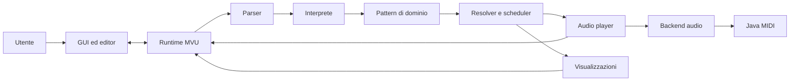
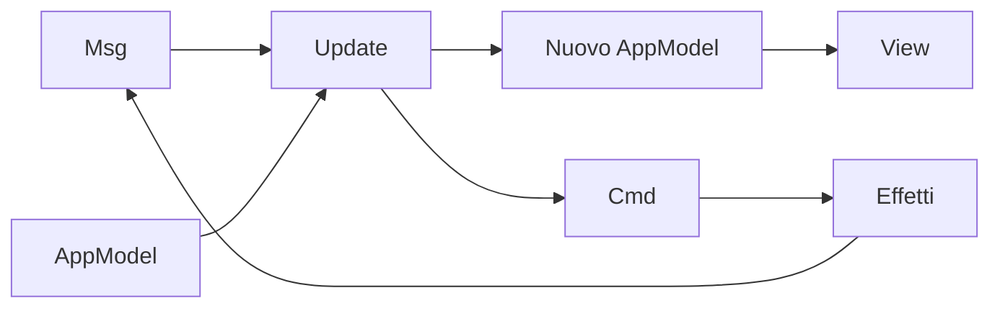
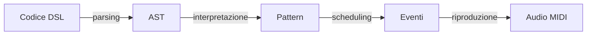

# Design architetturale

## Architettura complessiva

### Vista d'insieme

 L'architettura separa la gestione dell'interfaccia e dello stato applicativo dall'interpretazione della DSL, dalla generazione degli eventi temporali e dalla riproduzione audio.

Il sistema non è distribuito: tutti i componenti sono eseguiti localmente nello stesso processo JVM, pur avendo responsabilità e vincoli di concorrenza differenti.

Il flusso principale procede dal testo scritto dall'utente verso il backend audio. Le informazioni di stato, gli errori e le posizioni degli eventi in riproduzione ritornano invece al runtime MVU e vengono mostrate dalla GUI.

### Componenti e responsabilità

| Componente | Responsabilità |
|---|---|
| GUI ed editor | Acquisisce il codice e i comandi dell'utente; visualizza errori, evidenziazioni e timeline. |
| Runtime MVU | Mantiene lo stato applicativo e coordina le operazioni tramite messaggi e comandi. |
| Parser | Verifica la sintassi della DSL e trasforma il testo in un AST, conservando le coordinate sorgente. |
| Interprete | Traduce l'AST nel modello semantico dei pattern musicali. |
| Dominio | Definisce pattern, intervalli, eventi, tempo e payload audio mediante strutture indipendenti dall'infrastruttura. |
| Resolver e scheduler | Proiettano i pattern su intervalli temporali e costruiscono le timeline degli eventi. |
| Audio player | Gestisce play, stop, sostituzione della timeline e riproduzione temporizzata degli eventi. |
| Backend audio | Traduce i payload del dominio in operazioni eseguibili dal motore audio. |
| Motore MIDI | Produce concretamente note e percussioni tramite Java MIDI. |
| Visualizzazioni | Rappresentano graficamente gli eventi mediante piano roll e oscilloscopio. |

### Flusso principale di esecuzione

1. L'utente modifica il programma nell'editor e richiede un aggiornamento.
2. Il parser produce un AST oppure un errore con posizione nel testo.
3. L'interprete converte l'AST in pattern appartenenti al dominio.
4. I resolver e lo scheduler generano gli eventi temporali e le timeline necessarie alle viste.
5. Il runtime aggiorna il modello e, di conseguenza, l'interfaccia.
6. Durante la riproduzione, l'audio player invia gli eventi al backend MIDI rispettando il tempo configurato.
7. Le notifiche del player ritornano al runtime per aggiornare le evidenziazioni nell'editor.

Se il parsing del nuovo codice fallisce, le fasi successive non vengono eseguite. L'errore viene mostrato nella GUI, mentre la precedente timeline valida può continuare a essere riprodotta.

## Pattern architetturali

### Model-View-Update

La gestione dell'interfaccia segue il pattern architetturale **Model--View--Update (MVU)**. I suoi elementi principali sono:

- **Model:** `AppModel` contiene lo stato osservabile dell'applicazione, come riproduzione, errori, timeline, visualizzatori e posizioni da evidenziare;
- **View:** la GUI ScalaFX viene aggiornata a partire dal modello;
- **Update:** `Update.update` elabora un `Msg` e restituisce il nuovo modello insieme a un eventuale `Cmd`.

Le interazioni dell'utente e le notifiche del motore sono rappresentate come messaggi. La funzione di aggiornamento decide la transizione di stato e descrive gli effetti da eseguire tramite un comando; il runtime applica il nuovo modello, aggiorna la vista ed esegue il comando. Il risultato dell'effetto può rientrare nel ciclo sotto forma di un nuovo messaggio.

MVU centralizza lo stato, rende esplicite le transizioni e separa la logica applicativa dagli effetti collaterali. Nel contesto del live coding, questa separazione consente di segnalare gli errori del nuovo programma senza sostituire una timeline valida già in esecuzione.

### Architettura a livelli e pipeline

Il nucleo segue anche un'architettura **a livelli**, organizzata come una pipeline di trasformazioni prevalentemente unidirezionale:

Ogni passaggio introduce una rappresentazione con uno scopo distinto:

- il codice DSL è la rappresentazione testuale inserita dall'utente;
- l'AST descrive la struttura sintattica del programma;
- i pattern esprimono la semantica musicale indipendentemente dalla riproduzione concreta;
- gli eventi collocano i contenuti musicali in intervalli temporali;
- i comandi MIDI realizzano l'esecuzione audio.

La separazione permette di modificare e verificare ciascuna fase con un impatto limitato sulle altre. In particolare, parser e interprete non dipendono dall'infrastruttura audio, mentre scheduler e visualizzazioni lavorano sul modello del dominio.

### Pattern di supporto

#### Command

Il tipo `Cmd` rappresenta esplicitamente gli effetti collaterali prodotti da una transizione MVU, come il parsing, l'aggiornamento della timeline e l'avvio o l'arresto della riproduzione. In questo modo la decisione di eseguire un'operazione rimane separata dalla sua esecuzione concreta.

#### Composite

I pattern musicali formano strutture ricorsive nelle quali elementi atomici possono essere combinati mediante sequenze, parallelismi, alternanze e trasformazioni temporali. Elementi semplici e composizioni complesse possono quindi essere trattati attraverso lo stesso modello astratto.

#### Ports and Adapters

Le astrazioni `AudioBackend` e `AudioEngine` costituiscono il confine tra il nucleo applicativo e l'infrastruttura audio. Il dominio non dipende direttamente da Java MIDI: il backend concreto può essere sostituito oppure simulato durante i test di scheduler e player.

#### Strategy

La risoluzione è suddivisa tra componenti specializzati, tra cui `AtomResolver`, `SequenceResolver`, `ParallelResolver`, `AlternationResolver`, `TimeWarpResolver` e `WithExtensionsResolver`. Ogni componente incapsula l'algoritmo relativo a una forma di pattern, mentre `PatternResolver` seleziona la strategia appropriata.

## Distribuzione e concorrenza

SoundCode non presenta componenti distribuiti: GUI, parser, interprete, scheduler e backend audio sono eseguiti localmente nello stesso processo JVM. Non sono presenti servizi remoti, protocolli di rete o comunicazioni tra nodi diversi.

L'assenza di distribuzione non elimina tuttavia i vincoli di concorrenza. JavaFX richiede che gli aggiornamenti grafici siano eseguiti sul proprio application thread, mentre il ciclo di riproduzione deve procedere senza dipendere dal rendering della GUI. Le notifiche prodotte dall'audio player vengono quindi ricondotte al runtime MVU e inoltrate alla vista rispettando il modello di threading di JavaFX.

Il backend può inoltre degradare a un comportamento privo di riproduzione quando il sintetizzatore MIDI non è disponibile. Gli errori dell'input vengono rappresentati nello stato applicativo, mentre i guasti infrastrutturali devono essere contenuti al confine del backend.

## Scelte tecnologiche rilevanti

| Tecnologia o scelta | Ruolo | Rilevanza architetturale |
|---|---|---|
| Scala 3 | Linguaggio principale | Tipi algebrici, pattern matching e strutture immutabili favoriscono la modellazione del dominio e le transizioni MVU. |
| ScalaFX e JavaFX | Interfaccia desktop | Permettono una GUI locale reattiva e impongono un modello di threading specifico per gli aggiornamenti grafici. |
| RichTextFX | Editor della DSL | Supporta evidenziazione sintattica, numeri di riga e associazione tra testo ed errori o eventi. |
| Java MIDI | Produzione audio | Mantiene l'esecuzione locale e non richiede servizi o runtime audio esterni. |
| `LazyList` | Timeline di riproduzione | Consente di rappresentare pattern ciclici senza materializzare una sequenza infinita. |
| Tempo razionale | Modello temporale | Evita l'accumulo degli errori di approssimazione nelle composizioni e trasformazioni annidate. |
| Strutture immutabili | Stato e dominio | Rendono prevedibili le trasformazioni e semplificano la verifica delle funzioni pure. |

ScalaFX, RichTextFX e Java MIDI sono confinati ai livelli di presentazione e infrastruttura e non contaminano il modello del dominio.

## Conseguenze delle scelte architetturali

### Vantaggi

- separazione chiara delle responsabilità;
- dominio indipendente dalla GUI e dal backend MIDI;
- transizioni di stato esplicite e verificabili;
- possibilità di testare il motore senza un dispositivo audio reale;
- rappresentazione naturale di pattern ricorsivi e potenzialmente infiniti;
- sostituibilità delle implementazioni audio attraverso interfacce dedicate.

### Limiti

- applicazione legata all'ecosistema desktop JVM;
- aggiornamenti grafici vincolati al thread JavaFX;
- capacità sonore del backend MIDI inferiori rispetto a motori audio specializzati;
- assenza di collaborazione remota o distribuzione della riproduzione;
- necessità di coordinare il tempo della riproduzione con gli aggiornamenti della GUI.
