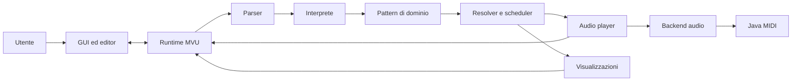
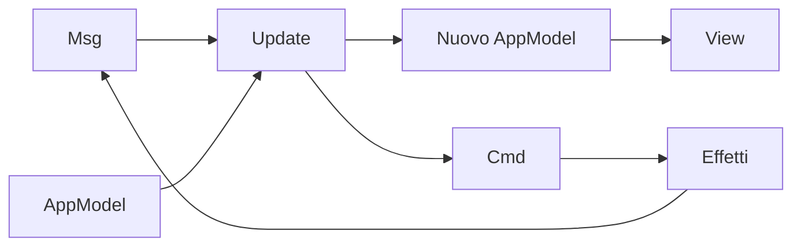
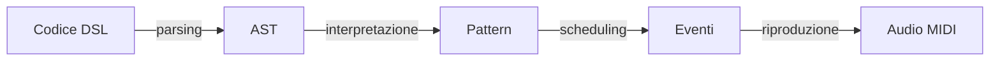

## Architettura complessiva

### Vista d'insieme

 L'architettura separa la gestione dell'interfaccia e dello stato applicativo dall'interpretazione della DSL, dalla generazione degli eventi temporali e dalla riproduzione audio.

Il sistema non è distribuito: tutti i componenti sono eseguiti localmente nello stesso processo JVM, pur avendo responsabilità e vincoli di concorrenza differenti.

Il flusso principale procede dal testo scritto dall'utente verso il backend audio. Le informazioni di stato, gli errori e le posizioni degli eventi in riproduzione ritornano invece al runtime MVU e vengono mostrate dalla GUI.

### Componenti e responsabilità

| Componente | Responsabilità |
|---|---|
| GUI ed editor | Acquisisce il codice e i comandi dell'utente; visualizza errori, evidenziazioni e timeline. |
| Runtime MVU | Mantiene lo stato applicativo e coordina le operazioni tramite messaggi e comandi. |
| Parser | Verifica la sintassi della DSL e trasforma il testo in un AST, conservando le coordinate sorgente. |
| Interprete | Traduce l'AST nel modello semantico dei pattern musicali. |
| Dominio | Definisce pattern, intervalli, eventi, tempo e payload audio mediante strutture indipendenti dall'infrastruttura. |
| Resolver e scheduler | Proiettano i pattern su intervalli temporali e costruiscono le timeline degli eventi. |
| Audio player | Gestisce play, stop, sostituzione della timeline e riproduzione temporizzata degli eventi. |
| Backend audio | Traduce i payload del dominio in operazioni eseguibili dal motore audio. |
| Motore MIDI | Produce concretamente note e percussioni tramite Java MIDI. |
| Visualizzazioni | Rappresentano graficamente gli eventi mediante piano roll. |

## Pattern architetturali

### Model-View-Update

Il coordinamento dello stato applicativo e dell’interfaccia segue il pattern architetturale **Model-View-Update (MVU)**. I suoi elementi principali sono:

- **Model:** `AppModel` contiene lo stato osservabile dell'applicazione, come riproduzione, errori, timeline, visualizzatori e posizioni da evidenziare;
- **View:** la GUI ScalaFX viene aggiornata a partire dal modello;
- **Update:** `Update.update` elabora un `Msg` e restituisce il nuovo modello insieme a un eventuale `Cmd`.

Le interazioni dell'utente e le notifiche dei sottosistemi sono rappresentate
come messaggi. La funzione di aggiornamento decide la transizione di stato e
descrive gli effetti da eseguire tramite un comando. Il runtime costituisce il
punto di coordinamento del ciclo: serializza i messaggi, applica il nuovo
modello, aggiorna la vista ed esegue il comando. Il risultato dell'effetto può
rientrare nel ciclo sotto forma di un nuovo messaggio.

MVU centralizza lo stato, rende esplicite le transizioni e separa la logica applicativa dagli effetti collaterali. Nel contesto del live coding, questa separazione consente di segnalare gli errori del nuovo programma senza sostituire una timeline valida già in esecuzione.

In questo ciclo, `Cmd` rappresenta esplicitamente gli effetti collaterali
richiesti da una transizione, come il parsing, l'aggiornamento della timeline e
l'avvio o l'arresto della riproduzione. La funzione di aggiornamento non esegue
direttamente queste operazioni, ma restituisce una descrizione dell'effetto al
runtime, che la interpreta e ne reinserisce l'esito nel flusso sotto forma di
messaggio. La serializzazione stabilisce inoltre un ordine totale fra le
transizioni quando le notifiche provengono da thread differenti. `Cmd`
completa quindi la separazione fra la decisione applicativa e l'interazione
concreta con i sottosistemi.

### Architettura a livelli e pipeline

Il nucleo segue anche un'architettura **a livelli**, organizzata come una pipeline di trasformazioni prevalentemente unidirezionale:

Ogni passaggio introduce una rappresentazione con uno scopo distinto:

- il codice DSL è la rappresentazione testuale inserita dall'utente;
- l'AST descrive la struttura sintattica del programma;
- i pattern esprimono la semantica musicale indipendentemente dalla riproduzione concreta;
- gli eventi collocano i contenuti musicali in intervalli temporali;
- i comandi MIDI realizzano l'esecuzione audio.

La separazione permette di modificare e verificare ciascuna fase con un impatto limitato sulle altre. In particolare, parser e interprete non dipendono dall'infrastruttura audio, mentre scheduler e visualizzazioni lavorano sul modello del dominio.

## Scelte tecnologiche rilevanti

| Tecnologia o scelta | Ruolo | Rilevanza architetturale |
|---|---|---|
| Scala 3 | Linguaggio principale | Tipi algebrici, pattern matching e strutture immutabili favoriscono la modellazione del dominio e le transizioni MVU. |
| FastParse | Parsing della DSL | I parser combinator permettono di esprimere la grammatica direttamente in Scala e di costruire l'AST mantenendo il parsing confinato nel relativo componente. |
| ScalaFX e JavaFX | Interfaccia desktop | Permettono una GUI locale reattiva e impongono un modello di threading specifico per gli aggiornamenti grafici. |
| RichTextFX | Editor della DSL | Supporta evidenziazione sintattica, numeri di riga e associazione tra testo ed errori o eventi. |
| Java MIDI | Produzione audio | Mantiene l'esecuzione locale e non richiede servizi o runtime audio esterni. |
| `LazyList` | Timeline di riproduzione | Consente di rappresentare pattern ciclici senza materializzare una sequenza infinita. |
| Tempo razionale | Modello temporale | Evita l'accumulo degli errori di approssimazione nelle composizioni e trasformazioni annidate. |
| Strutture immutabili | Stato e dominio | Rendono prevedibili le trasformazioni e semplificano la verifica delle funzioni pure. |

FastParse, ScalaFX, RichTextFX e Java MIDI sono confinati ai rispettivi livelli di parsing, presentazione e infrastruttura e non contaminano il modello del dominio.
