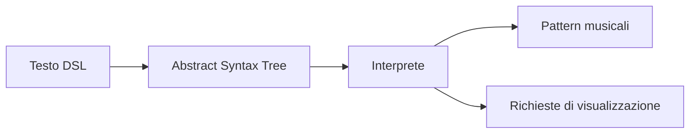
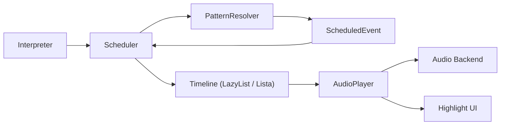
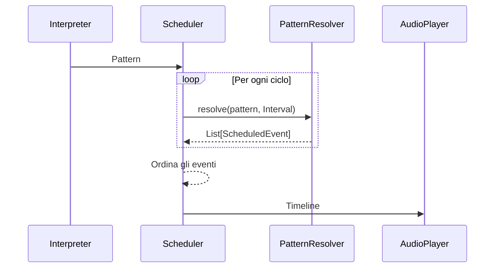
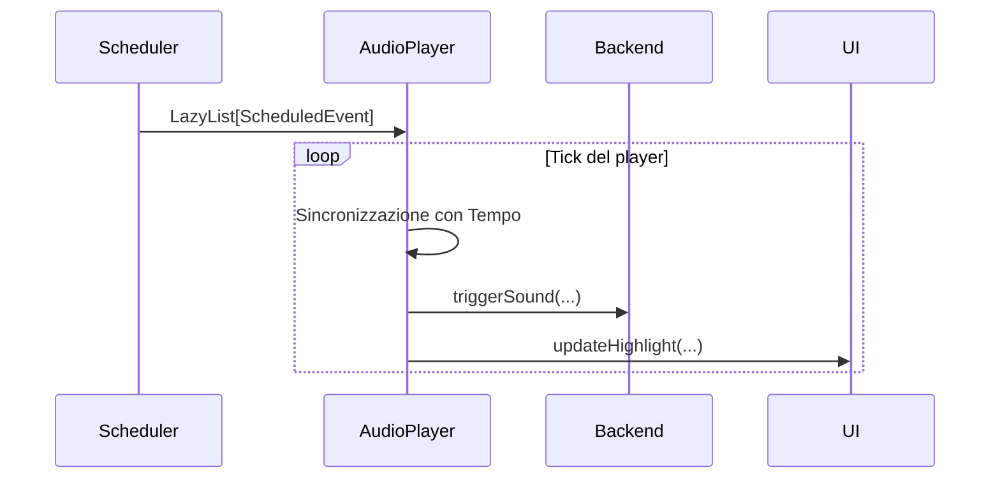
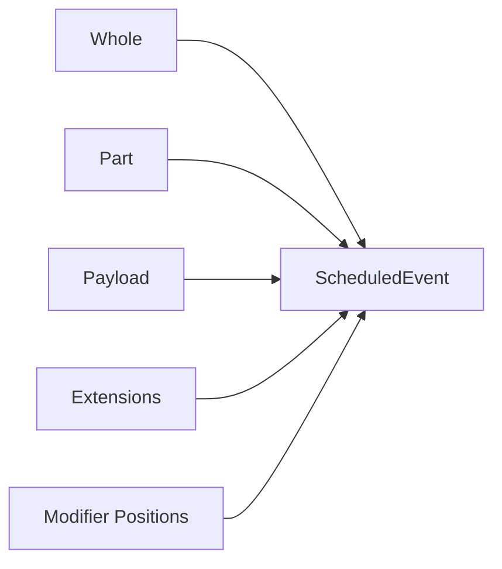
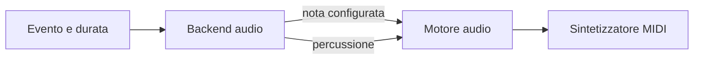
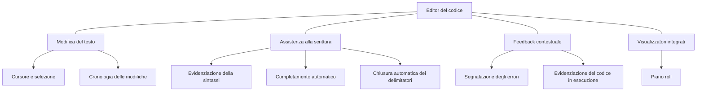

# Desing

## Parser e interprete — Cristian Morbidelli

## Dalla sintassi alla semantica

Il sottosistema linguistico rappresenta il punto di ingresso dell'intero sistema. Il suo compito consiste nel trasformare un programma scritto nella DSL in una rappresentazione semantica utilizzabile dal motore di esecuzione.

Per mantenere separati gli aspetti puramente sintattici da quelli musicali, il processo è suddiviso in due fasi distinte:

1. **Parsing**, che riconosce la grammatica del linguaggio e costruisce un *Abstract Syntax Tree* (AST);
2. **Interpretazione**, che converte l'AST in strutture appartenenti al dominio musicale.



L'introduzione di una rappresentazione intermedia consente di disaccoppiare completamente il linguaggio dal motore di esecuzione.

L'engine non deve conoscere parole chiave, parentesi, virgolette o altre convenzioni sintattiche della DSL, ma riceve esclusivamente strutture semantiche che descrivono il comportamento musicale. Analogamente, il parser non necessita di conoscere il funzionamento interno del motore di esecuzione, limitandosi a verificare che il programma rispetti la grammatica del linguaggio.

Questa separazione rende i due sottosistemi indipendenti e permette di evolvere la sintassi della DSL senza modificare il motore musicale, oppure introdurre nuove primitive musicali mantenendo invariata la grammatica esistente.

---

# Il modello sintattico

L'AST rappresenta esclusivamente la struttura del programma, senza attribuire alcun significato esecutivo ai nodi.

L'obiettivo non è descrivere *come* un pattern verrà eseguito, ma *come* esso è stato espresso nella DSL. Questa distinzione permette di conservare tutte le informazioni sintattiche necessarie all'interpretazione, eliminando al tempo stesso qualsiasi dipendenza dalle strutture interne del dominio musicale.


L'albero è organizzato come una gerarchia di blocchi, nella quale ogni nodo rappresenta uno specifico costrutto della DSL. La scelta di utilizzare una gerarchia tipizzata permette di rendere esplicito il ruolo di ciascun elemento del linguaggio e di limitare le combinazioni sintatticamente ammissibili già a livello della rappresentazione intermedia.

La radice dell'albero è costituita dal **Program**, che contiene una sequenza ordinata di blocchi. Tali blocchi appartengono a due categorie principali:

- **StreamBlock**, che rappresentano gli stream musicali;
- **SettingBlock**, che rappresentano configurazioni globali del programma.

I blocchi di configurazione sono indipendenti dagli stream e descrivono parametri validi per l'intera esecuzione. Attualmente il linguaggio supporta:

- **CPM**, che definisce il numero di cicli eseguiti in un minuto;
- **CPS**, che definisce il numero di cicli eseguiti in un secondo.

Ogni **StreamBlock** costituisce invece un flusso musicale autonomo ed è composto da tre componenti principali:

- un **GenerativeBlock**, che produce il pattern iniziale;
- una sequenza di **ExtensionBlock**, applicate progressivamente al pattern;
- un eventuale **VisualizerBlock**, destinato esclusivamente alla componente grafica.

Le estensioni sono ulteriormente suddivise in due categorie:

- **GenerativeExtensionBlock**, che introducono nuovi generatori musicali;
- **TransformationExtensionBlock**, che modificano il comportamento del pattern esistente.

I generatori costituiscono il punto di partenza di ogni stream e sono modellati attraverso due sole tipologie:

- **SoundBlock**, utilizzato per descrivere pattern di campioni audio;
- **NoteBlock**, utilizzato per descrivere pattern di note musicali.

Le richieste di visualizzazione sono invece rappresentate separatamente attraverso i **VisualizerBlock**. Questa scelta evita che le componenti grafiche influenzino il comportamento musicale dello stream e permette di aggiungere nuovi strumenti di visualizzazione senza modificare il motore audio.

Nella versione corrente della DSL è disponibile il visualizzatore **PianoRollBlock**, che richiede la rappresentazione dello stream mediante una vista pianoroll sincronizzata con l'esecuzione.

Le trasformazioni costituiscono infine la categoria più articolata dell'AST. Dal punto di vista progettuale esse vengono tutte modellate come specializzazioni di **TransformationBlock**, pur rappresentando operazioni concettualmente differenti.

È possibile distinguere quattro famiglie principali:

- **Effetti audio**, che modificano le caratteristiche timbriche del suono (`Gain`, `Pan`, `Room`, `Delay`, `LowPassFilter`, `HighPassFilter`);
- **Trasformazioni temporali**, che alterano la distribuzione degli eventi nel tempo (`FastForward`, `SlowMotion`, `Early`, `Late`, `Reverse`, `Repetition`);
- **Trasformazioni composte**, che permettono di combinare più operazioni (`Juxtaposition`) oppure di applicarle con uno sfasamento temporale (`Offset`);
- **Trasformazioni sconosciute**, rappresentate dal nodo `Unknown`, introdotto esclusivamente per gestire in modo controllato eventuali costrutti non riconosciuti durante l'analisi.

Questa organizzazione rende l'AST facilmente estendibile: l'introduzione di un nuovo comando della DSL richiede generalmente soltanto l'aggiunta di una nuova specializzazione della categoria corrispondente, senza modificare la struttura generale dell'albero.

---

## Lo stream musicale

Lo stream rappresenta l'unità fondamentale di composizione della DSL. Ogni stream descrive un flusso musicale indipendente, eventualmente riprodotto in parallelo ad altri stream se ve ne sono.

Dal punto di vista strutturale ogni stream è composto da tre sezioni logicamente distinte:

- un **generatore**, che definisce il pattern iniziale base dello stream di cui detta il tempo;
- una sequenza ordinata di **estensioni**, applicate progressivamente al risultato precedente da sinistra verso destra;
- un'eventuale **richiesta di visualizzazione** dello stream, possibilmente intercettata da una interfaccia grafica.

```text
Generatore
      │
      ▼
Estensione
      │
      ▼
Estensione
      │
      ▼
Visualizzatore
```

Questa organizzazione riflette direttamente la sintassi della DSL, nella quale le operazioni vengono concatenate mediante notazione puntata (**mini-notation**). Ogni estensione riceve implicitamente il risultato prodotto fino a quel punto, modellando una pipeline di trasformazioni facilmente estendibile.

---

# Pattern sintattici

L'elemento centrale dell'AST è il **Pattern**, scelto come rappresentazione ricorsiva della struttura ritmica del linguaggio.

Anziché modellare direttamente eventi temporali, il parser conserva la struttura sintattica del pattern, lasciando all'interprete il compito di attribuirle un significato musicale.

Il modello è organizzato gerarchicamente.

```text
Pattern
 ├── Sequence
 │     ├── Element
 │     ├── Element
 │     └── Element
 ├── Sequence
 └── Sequence
```

Ogni livello della gerarchia rappresenta un costrutto della DSL con un significato e comportamento ben specifici.

## Pattern

Un pattern rappresenta l'intero contenuto di un ciclo musicale, ed occupa quindi interamente la durata del ciclo in cui viene contenuto.

Esso è composto da una o più sequenze. La presenza di più sequenze rappresenta la sovrapposizione ritmica (layering), ottenuta nella DSL mediante la separazione con virgole. Le diverse sequenze di uno stesso pattern hanno quindi medesima durata e devono avvenire contemporaneamente.

Il pattern costituisce quindi l'unità temporale principale sulla quale operano generatori e trasformazioni.

---

## Sequence

Una sequenza rappresenta una successione ordinata di elementi consecutivi.

La durata del ciclo viene implicitamente suddivisa tra gli elementi appartenenti alla sequenza, definendo così il ritmo fondamentale del pattern.

La sequenza costituisce quindi la struttura temporale di base del linguaggio.

---

## Element

L'elemento rappresenta la più piccola unità componibile di una sequenza.

Per evitare duplicazioni strutturali, il modello distingue quattro tipologie:

- **AtomElement**, contenente un singolo atomo musicale non ulteriormente espandibile;
- **SubPatternElement**, che introduce un pattern annidato come elemento di una sequenza, riesplorato poi in maniera ricorsiva;
- **AlternationElement**, che rappresenta un particolare tipo di pattern in cui gli elementi delle sue sequenze vengono riprodotti alternandosi in ciascun ciclo successivo (con un **round-robin** ordinato);
- **SpeedModifiedElement**, un elemento che contiene una variazione locale della velocità.

---

# Atomi

Alla base della gerarchia si trovano gli **atomi**, ovvero gli elementi indivisibili riconosciuti dal parser.

Il modello distingue quattro categorie:

- note musicali;
- campioni audio (*sample*);
- silenzi;
- valori numerici.

Le prime tre rappresentano contenuto musicale, mentre i valori numerici costituiscono i parametri utilizzati da trasformazioni e impostazioni del linguaggio.

Pur appartenendo a domini concettualmente differenti, tutte queste entità vengono modellate come atomi per consentire il riutilizzo della stessa struttura ricorsiva dei pattern.

Di conseguenza anche un parametro numerico può essere espresso mediante sequenze, parallelismi, sottopattern o alternanze, senza introdurre grammatiche differenti per note, effetti e configurazioni.

Questa uniformità costituisce uno dei principi progettuali dell'interprete, che può trattare qualsiasi valore variabile nel tempo attraverso un'unica rappresentazione sintattica.

---

# Estensioni

Le operazioni applicabili ad uno stream vengono modellate separatamente dal generatore.

Dal punto di vista concettuale il linguaggio distingue due categorie di estensioni.

## Estensioni generative

Le estensioni generative introducono nuovi pattern sonori destinati ad essere combinati con il pattern corrente.

Esse rappresentano quindi nuove sorgenti musicali che partecipano alla costruzione del risultato finale.

## Trasformazioni

Le trasformazioni modificano invece il comportamento del pattern già esistente.

L'AST distingue numerose trasformazioni (effetti audio, modifiche temporali, ripetizioni, offset e altre operazioni), ma tutte condividono la medesima responsabilità: descrivere una modifica applicabile ad un pattern.

Questa distinzione rende esplicito il ruolo di ciascun costrutto della DSL e permette al parser di verificare che soltanto determinate forme sintattiche possano comparire in specifici punti del linguaggio.

---

# Conservazione delle informazioni sorgente

Una caratteristica progettuale dell'AST consiste nel mantenere il collegamento con il testo originale.

Ogni atomo conserva infatti la posizione iniziale e finale all'interno del programma sorgente. Tali informazioni non partecipano alla semantica musicale del linguaggio, ma vengono propagate durante l'interpretazione fino agli oggetti del dominio.

In questo modo la componente grafica può evidenziare in tempo reale le note o i campioni attualmente in esecuzione senza dover analizzare nuovamente il testo della DSL.

L'AST assume quindi anche il ruolo di ponte tra editor ed engine, consentendo la sincronizzazione dell'interfaccia utente con l'esecuzione musicale mantenendo completamente separati gli aspetti grafici da quelli sonori.

---

# Interpretazione semantica

L'interpretazione rappresenta il passaggio dall'AST, costruito secondo le esigenze della grammatica, alle strutture utilizzate dal motore musicale.

Mentre l'AST conserva la forma con cui il programma è stato scritto, il modello di dominio descrive esclusivamente il comportamento musicale che dovrà essere eseguito. Durante questa fase vengono quindi eliminate tutte le informazioni sintattiche prive di significato semantico, preservando esclusivamente la struttura temporale e le informazioni necessarie all'esecuzione.

L'interprete non modifica il comportamento espresso dal programma, ma effettua una traduzione strutturale tra due modelli appartenenti a livelli di astrazione differenti giungendo ad una rappresentazione significativa e chiara degli stream musicali descritti nel linguaggio del dominio definito a priori.

---

## Separazione tra contenuto musicale e configurazione

Il programma può contenere sia stream musicali sia impostazioni globali.

Queste due categorie vengono interpretate indipendentemente.

Gli stream producono pattern eseguibili, mentre i blocchi di configurazione vengono convertiti in una rappresentazione del tempo globale utilizzata successivamente dal motore di schedulazione.

In questo modo le informazioni relative alla composizione musicale rimangono completamente separate dalla configurazione dell'ambiente di esecuzione.

---

# Interpretazione semantica

L'interprete costituisce il collegamento tra il linguaggio e il motore musicale.

Il suo compito consiste nel trasformare l'Abstract Syntax Tree prodotto dal parser in una rappresentazione appartenente esclusivamente al dominio applicativo, eliminando ogni dettaglio puramente sintattico della DSL.

Mentre l'AST descrive **come** il programma è stato scritto, il modello di dominio descrive **che cosa** deve essere eseguito.

Durante questa fase vengono quindi eliminati elementi quali parole chiave, parentesi, separatori e altri costrutti grammaticali, preservando esclusivamente la struttura musicale espressa dal programma.

L'interprete non esegue direttamente gli stream musicali, ma costruisce un modello semantico che verrà successivamente utilizzato dal motore di schedulazione e dai componenti audio.

Questa separazione mantiene completamente indipendenti il linguaggio, il modello musicale e il motore di esecuzione.

---

## Separazione delle responsabilità

L'AST può contenere tre categorie di informazioni differenti:

- stream musicali;
- impostazioni globali;
- richieste di visualizzazione.

L'interprete tratta queste categorie indipendentemente, producendo tre risultati distinti.

Gli stream vengono convertiti nei pattern eseguibili dal motore musicale.

Le impostazioni globali vengono trasformate nella rappresentazione del tempo utilizzata dall'ambiente di esecuzione.

Le richieste di visualizzazione vengono invece estratte separatamente e destinate esclusivamente ai componenti grafici.

Questa scelta impedisce che il motore audio debba conoscere aspetti relativi all'interfaccia utente e consente ai due sottosistemi di evolvere indipendentemente.

---

## Interpretazione ricorsiva dei pattern

L'interpretazione dei pattern segue fedelmente la struttura ricorsiva dell'AST.

Ogni livello dell'albero viene convertito nel corrispondente costrutto del dominio:

- gli atomi diventano eventi musicali;
- le sequenze diventano successioni temporali;
- i pattern contenenti più sequenze diventano composizioni parallele;
- i sottopattern mantengono la propria struttura gerarchica;
- le alternanze vengono convertite in pattern ciclici;
- i modificatori locali di velocità diventano trasformazioni temporali applicate esclusivamente all'elemento interessato.

L'interprete non ricostruisce la struttura del pattern durante questa fase, ma la preserva integralmente.

Ciò consente di mantenere una corrispondenza diretta tra il modello sintattico e quello di dominio, rendendo il comportamento del linguaggio facilmente prevedibile.

---

## Uniformità dell'interpretazione

Una delle principali scelte progettuali consiste nel riutilizzare il medesimo processo di interpretazione per tutte le tipologie di pattern presenti nel linguaggio.

Pattern di note, campioni audio e configurazioni numeriche condividono infatti la stessa struttura ricorsiva.

L'interprete opera esclusivamente sulla forma del pattern, mentre la conversione del singolo atomo viene delegata a componenti specializzate.

In questo modo l'algoritmo di interpretazione risulta completamente indipendente dal contenuto del pattern.

L'aggiunta di nuove tipologie di atomi non richiede quindi modifiche alla logica ricorsiva dell'interprete, ma esclusivamente la definizione della relativa conversione verso il dominio.

Questa scelta riduce la duplicazione di codice e garantisce un comportamento uniforme dell'intero linguaggio.

---

## Interpretazione degli stream

Ogni stream viene interpretato a partire dal proprio generatore.

Il generatore produce il pattern musicale di base, sul quale vengono applicate progressivamente tutte le estensioni nell'ordine in cui sono state dichiarate nella DSL.

Dal punto di vista semantico le estensioni non costituiscono un insieme omogeneo.

L'interprete distingue infatti tre categorie differenti:

- generatori aggiuntivi;
- effetti audio;
- trasformazioni temporali.

Questa distinzione riflette il diverso significato che tali operazioni assumono nel dominio musicale e costituisce uno dei principi fondamentali del modello adottato.

---

## Estensioni generative

Le estensioni generative introducono nuovi pattern sonori che devono essere riprodotti insieme al pattern principale.

Esse non modificano la struttura temporale dello stream, ma aggiungono nuove sorgenti musicali sincronizzate con esso.

Per questo motivo vengono mantenute come componenti indipendenti fino alla costruzione della rappresentazione finale del pattern.

---

## Gestione degli effetti audio

Gli effetti audio rappresentano proprietà associate agli eventi musicali.

Volume, panoramica, riverbero, delay e filtri modificano infatti il modo in cui un evento viene riprodotto, ma non alterano la sua posizione temporale.

Per questo motivo il modello di dominio non rappresenta gli effetti come trasformazioni annidate del pattern.

Durante l'interpretazione ogni effetto viene convertito in un pattern indipendente, sincronizzato temporalmente con il pattern principale.

Gli effetti prodotti dalle varie estensioni vengono progressivamente accumulati durante l'interpretazione dello stream.

Al termine dell'elaborazione essi vengono raccolti in un'unica struttura del dominio che associa il pattern musicale all'insieme completo delle estensioni audio.

Concettualmente il risultato assume la forma seguente.

```text
Pattern
   │
WithExtensions
 ├── Gain
 ├── Pan
 ├── Delay
 └── LowPass
```

Questa scelta progettuale presenta diversi vantaggi.

Innanzitutto evita la costruzione di lunghe catene di effetti annidati, mantenendo il modello del dominio semplice e leggibile.

Inoltre rende esplicito il fatto che gli effetti rappresentano proprietà del suono piuttosto che modifiche della struttura del pattern.

Infine permette al motore audio di elaborare gli effetti come un insieme omogeneo, senza dover ricostruire la sequenza con cui sono stati dichiarati nella DSL.

L'introduzione di nuovi effetti risulta inoltre particolarmente semplice, poiché richiede esclusivamente l'aggiunta di una nuova tipologia di estensione senza alterare la struttura del modello.

---

## Gestione delle trasformazioni temporali

Le trasformazioni temporali seguono una filosofia completamente differente.

Operazioni come accelerazione, rallentamento, inversione, ripetizione o traslazione temporale modificano direttamente la struttura del pattern.

Esse non possono quindi essere rappresentate come semplici proprietà aggiuntive.

Ogni trasformazione genera immediatamente un nuovo pattern che racchiude quello prodotto fino a quel momento, costruendo una gerarchia ricorsiva di modificatori temporali.

Una sequenza di operazioni come

```text
.fast(2).rev().slow(3)
```

viene rappresentata concettualmente come

```text
Slow
 └── Reverse
      └── Fast
           └── Pattern
```

Ogni trasformazione opera quindi sul risultato prodotto dalla precedente, preservando esattamente la semantica della DSL.

---

## Trasformazioni composte

Alcune trasformazioni consentono di combinare più operazioni elementari.

In particolare le operazioni di giustapposizione e offset permettono di costruire modificatori composti, nei quali possono convivere sia effetti audio sia trasformazioni temporali.

L'interprete converte tali costrutti in un'unica struttura del dominio composta da modificatori elementari.

Questa scelta evita di introdurre casi particolari nel motore di esecuzione, che continua ad elaborare esclusivamente modificatori appartenenti al proprio modello.

---

## Combinazione tra effetti e trasformazioni temporali

La presenza contemporanea di effetti audio e trasformazioni temporali richiede una specifica strategia di interpretazione.

Quando durante l'interpretazione viene incontrata una trasformazione temporale, gli effetti audio accumulati fino a quel momento vengono dapprima associati al pattern corrente.

Successivamente la trasformazione temporale viene applicata all'intera struttura risultante.

Il modello ottenuto può essere rappresentato concettualmente come

```text
TimeWarp
    │
WithExtensions
 ├── Pattern
 ├── Gain
 ├── Pan
 └── Delay
```

Questa organizzazione garantisce che gli effetti rimangano sempre sincronizzati con il pattern anche in presenza di modifiche della struttura temporale.

La distinzione tra proprietà del suono e trasformazioni del tempo rappresenta uno dei principi fondamentali del modello di dominio e contribuisce a mantenerne la semplicità e l'estendibilità.

---

## Conservazione del collegamento con il sorgente

Durante l'intero processo di interpretazione viene mantenuto il collegamento con il programma sorgente.

Le coordinate associate agli atomi dell'AST vengono propagate agli oggetti del dominio, permettendo di risalire in qualsiasi momento alla porzione di testo dalla quale ogni evento musicale è stato generato.

Questa informazione viene utilizzata dalla componente grafica per sincronizzare l'esecuzione con l'editor, evidenziando in tempo reale gli elementi in riproduzione senza richiedere una nuova analisi sintattica del programma.

---

## Risultato dell'interpretazione

Al termine dell'interpretazione il programma viene trasformato in tre insiemi di informazioni indipendenti:

- i pattern musicali eseguibili dal motore audio;
- la configurazione temporale globale del programma;
- le richieste destinate ai componenti di visualizzazione.

Il modello risultante è completamente indipendente dalla sintassi della DSL e costituisce l'interfaccia tra il linguaggio e il resto dell'architettura dell'applicazione.

## Engine — Federico Morsucci

# Design di dettaglio
## Engine e Risoluzione Temporale

L'engine è progettato come una pipeline di elaborazione nella quale ogni componente svolge una singola responsabilità. L'obiettivo è trasformare il codice scritto dall'utente in una sequenza temporale di eventi musicali sincronizzati con il tempo reale, mantenendo completamente separati il processo di interpretazione del linguaggio, la pianificazione temporale e la riproduzione audio.

Il flusso di esecuzione del sistema è illustrato in Figura seguente.



L'interprete costituisce il punto di ingresso dell'engine. Dopo aver ricevuto il codice sorgente, costruisce la rappresentazione interna della composizione sotto forma di pattern e la passa allo scheduler.

Lo scheduler rappresenta il componente responsabile della costruzione della timeline musicale. Il suo compito non consiste nell'interpretare direttamente i pattern, bensì nel determinare quale intervallo temporale debba essere valutato in ogni istante. Per ciascun ciclo genera quindi una finestra temporale (`Interval`) e delega la risoluzione del pattern al `PatternResolver`.

Il `PatternResolver` percorre ricorsivamente l'albero dei pattern e produce una collezione di oggetti `ScheduledEvent`, ciascuno dei quali rappresenta un evento musicale completo di informazioni temporali, payload sonoro ed eventuali parametri aggiuntivi. Terminata la risoluzione, gli eventi vengono restituiti allo scheduler, che li ordina cronologicamente e costruisce la timeline finale.

Questo scambio di informazioni è rappresentato nella Figura seguente.



Lo scheduler espone due differenti modalità di generazione della timeline.

La prima produce una sequenza finita di eventi, ottenuta determinando la minima durata necessaria affinché il pattern completi un'intera ripetizione. Questa modalità è utilizzata principalmente per la visualizzazione grafica e per l'analisi statica della composizione.

La seconda modalità genera invece una `LazyList`, costruita dinamicamente un ciclo alla volta. In questo caso gli eventi non vengono calcolati anticipatamente, ma soltanto nel momento in cui risultano necessari alla riproduzione. Tale approccio consente di mantenere un consumo di memoria costante anche durante esecuzioni di durata arbitraria.

Una volta costruita la timeline, il controllo passa all'`AudioPlayer`, che rappresenta il punto di collegamento tra il dominio logico della composizione e il backend audio.

Il player non interpreta il linguaggio né esegue operazioni di scheduling: il suo unico compito consiste nel consumare progressivamente la timeline prodotta dallo scheduler, sincronizzando gli eventi con il tempo fisico del sistema.

Per ogni iterazione del proprio ciclo di esecuzione, il player confronta il tempo corrente con l'istante di attivazione degli eventi presenti nella timeline. Quando un evento diventa attivo, esso viene inviato al backend audio insieme alla durata calcolata e agli eventuali parametri applicati. Contestualmente vengono raccolte le posizioni del codice sorgente associate all'evento e notificate all'interfaccia grafica per aggiornare l'highlighting in tempo reale.

L'interazione tra scheduler e player è riassunta nella Figura seguente.



L'unità di informazione scambiata tra scheduler e player è rappresentata dallo `ScheduledEvent`. Ogni evento descrive completamente un'azione musicale e contiene sia il payload da riprodurre sia tutte le informazioni temporali necessarie alla sua esecuzione.



Ogni evento temporale è quindi definito da due intervalli distinti:

* **`whole` (Intero):** rappresenta l'estensione logica originale e completa dell'evento musicale nello spazio temporale assoluto.
* **`part` (Parte):** rappresenta esclusivamente la porzione dell'evento che risulta effettivamente visibile e attiva all'interno della finestra temporale in fase di elaborazione (il ciclo corrente).

**Perché questa separazione è necessaria?**

Questa distinzione, definita a livello strutturale, è la chiave architetturale per gestire in modo sicuro gli eventi che attraversano i confini di un ciclo ritmico.

Senza questa separazione, un evento a cavallo tra due cicli verrebbe visto dal motore come due frammenti separati. Grazie alla convivenza di `whole` e `part`, invece, il player può applicare una regola di esecuzione rigorosa: esegue il *triggering* della nota **una sola volta** (nell'istante esatto in cui inizia la sua vita effettiva), ma le assegna la durata totale corretta leggendola dal `whole`. Questo approccio previene in modo matematico l'insorgere di artefatti audio, evitando note troncate prematuramente al cambio di ciclo o, peggio, suonate due volte (*double-triggering*).

## Audio e MIDI — Tommaso Remedi

### Separazione tra scheduling e produzione sonora

L'engine non invia direttamente messaggi MIDI. Il player comunica con un **backend audio** mediante eventi già risolti; il backend traduce invece payload ed estensioni in richieste sonore. Un ulteriore **motore audio** incapsula il sintetizzatore e il ciclo di vita delle sue risorse.



Questa doppia astrazione permette di provare la temporizzazione con un backend controllato e di provare la traduzione MIDI senza avviare l'intera applicazione.

### Traduzione musicale

Il backend distingue tre casi:

- le note vengono convertite in numeri MIDI e associate a uno strumento General MIDI;
- i nomi dei suoni percussivi vengono convertiti nelle note del canale percussionistico;
- i silenzi non producono comandi sonori.

Le estensioni udibili vengono trasformate in parametri della nota o controlli di canale. Il guadagno determina la velocity; pan, riverbero e filtro passa-basso sono approssimati tramite controlli MIDI. Gli effetti privi di una corrispondenza MIDI adeguata (`hpf` e `delay`) restano nel modello, senza introdurre dipendenze nell'engine.

I canali melodici sono assegnati per voce, dove una voce identifica una combinazione compatibile di strumento e controlli. In questo modo note simultanee con configurazioni diverse non si sovrascrivono a vicenda, mentre il canale General MIDI dedicato alle percussioni resta riservato.

L'avvio di una nota è immediato, mentre la sua terminazione è pianificata in modo non bloccante. Se il sintetizzatore non è disponibile, un motore silenzioso mantiene operativo il resto dell'applicazione: parsing, scheduling, interfaccia e test non dipendono quindi dalla presenza di un dispositivo audio.

## Interfaccia utente — Giacomo Biagioni

### Coordinamento tramite Model–View–Update

La UI è organizzata secondo il modello MVU. Le azioni dell'utente, come
l'aggiornamento del codice o il controllo della riproduzione, vengono
trasformate in messaggi. La stessa modalità viene usata per comunicare alla UI
i risultati del parser e l'avanzamento della riproduzione. La funzione di
aggiornamento modifica quindi lo stato dell'interfaccia, dal quale viene
generata la nuova vista.

I casi principali sono:

| Messaggio | Variazione del modello | Operazione richiesta |
|---|---|---|
| Aggiornamento del codice | Nessuna variazione immediata | Analisi del testo |
| Analisi riuscita | Rimozione dell'errore precedente | Costruzione e sostituzione delle timeline |
| Analisi fallita | Aggiornamento della diagnostica | Nessuna |
| Play o stop | Aggiornamento dello stato di riproduzione | Avvio o arresto del player |
| Nuove timeline | Timeline, visualizzazioni e revisione vengono aggiornate insieme | Nessuna |
| Nuove posizioni attive | Sostituzione delle evidenziazioni correnti | Nessuna |

Il testo presente nell'editor non coincide necessariamente con lo stato
musicale in esecuzione. L'utente può continuare a scrivere, ma timeline e
visualizzazioni vengono sostituite solo quando preme Update e il nuovo codice è
valido. Se il parsing fallisce viene mostrato l'errore e la timeline precedente
rimane disponibile. Il modello contiene anche un numero di revisione, utile
alla vista per capire che è arrivato un nuovo aggiornamento anche quando le
timeline ottenute sono uguali alle precedenti.

### Editor come composizione di responsabilità

L'editor è il componente principale della UI, ma non contiene direttamente
tutte le funzionalità. La parte di base gestisce testo, cursore, selezione e
cronologia delle modifiche. Numeri di riga, syntax highlighting, autocomplete
e inserimento automatico delle parentesi sono aggiunti da componenti separati.
Anche i visualizzatori vengono mantenuti separati dal testo: sono mostrati
sopra l'editor e collegati alla posizione del comando che li ha richiesti.



Ogni componente segue un ciclo di aggiornamento distinto. L'evidenziazione
della sintassi reagisce alle modifiche del testo, la diagnostica riflette
l'ultimo aggiornamento del codice e l'indicazione degli elementi in esecuzione
segue l'avanzamento della riproduzione. Il piano roll, invece, visualizza la
timeline prodotta dall'engine senza modificarne il contenuto.

### Coerenza del feedback visivo

Il parser associa a ogni elemento la sua posizione nel codice sorgente e
propaga questa informazione fino alla UI. In questo modo l'editor può
evidenziare la nota o il sample in riproduzione e collocare il piano roll in
prossimità del comando corrispondente.

Le posizioni fanno però riferimento alla versione del codice da cui è stata
generata la timeline. Se il testo viene modificato senza eseguire un nuovo
aggiornamento, le evidenziazioni della riproduzione vengono nascoste per evitare
di indicare porzioni di codice non più valide. La posizione dei visualizzatori
integrati viene invece adattata alle modifiche del testo, così da mantenerli
associati alla riga che contiene il relativo comando.

I diversi tipi di feedback hanno quindi compiti distinti:

- la colorazione aiuta a leggere il codice, ma non dice se è valido;
- il banner mostra gli errori senza modificare il testo;
- gli highlight mostrano quali elementi stanno suonando;
- il piano roll mostra la disposizione degli eventi nel tempo e segue lo stato
  di play e stop.

## Contratti tra i sottosistemi

| Confine | Dati scambiati | Vincolo di design |
|---|---|---|
| UI → parser | Testo completo del programma | Il parsing avviene solo su richiesta di aggiornamento. |
| Parser → interprete | AST e coordinate sorgente | L'AST non contiene decisioni di scheduling o dettagli MIDI. |
| Interprete → engine | Pattern e payload del dominio | Il dominio è indipendente dalla sintassi concreta. |
| Engine → audio | Evento, durata ed estensioni risolte | Il backend non conosce AST, editor o combinatori di pattern. |
| Engine → UI | Timeline finite e posizioni attive | La UI osserva risultati, ma non calcola la semantica temporale. |
| Runtime → vista | Stato applicativo completo | Il rendering deriva dal modello e non avvia direttamente effetti. |

Questi contratti limitano la propagazione dei cambiamenti: una nuova resa sonora richiede principalmente un adattamento del backend; un nuovo costrutto temporale interessa AST, interpretazione e relativo resolver; una nuova visualizzazione può consumare timeline esistenti senza modificare la produzione audio.
