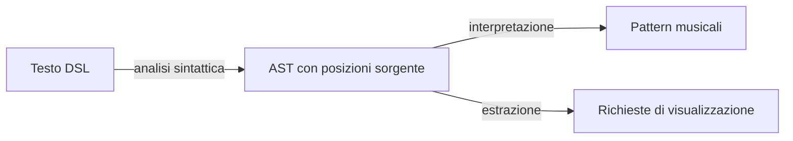
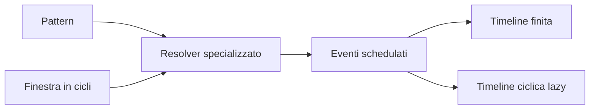
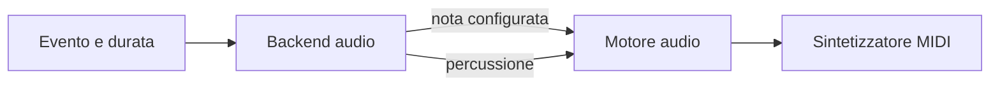
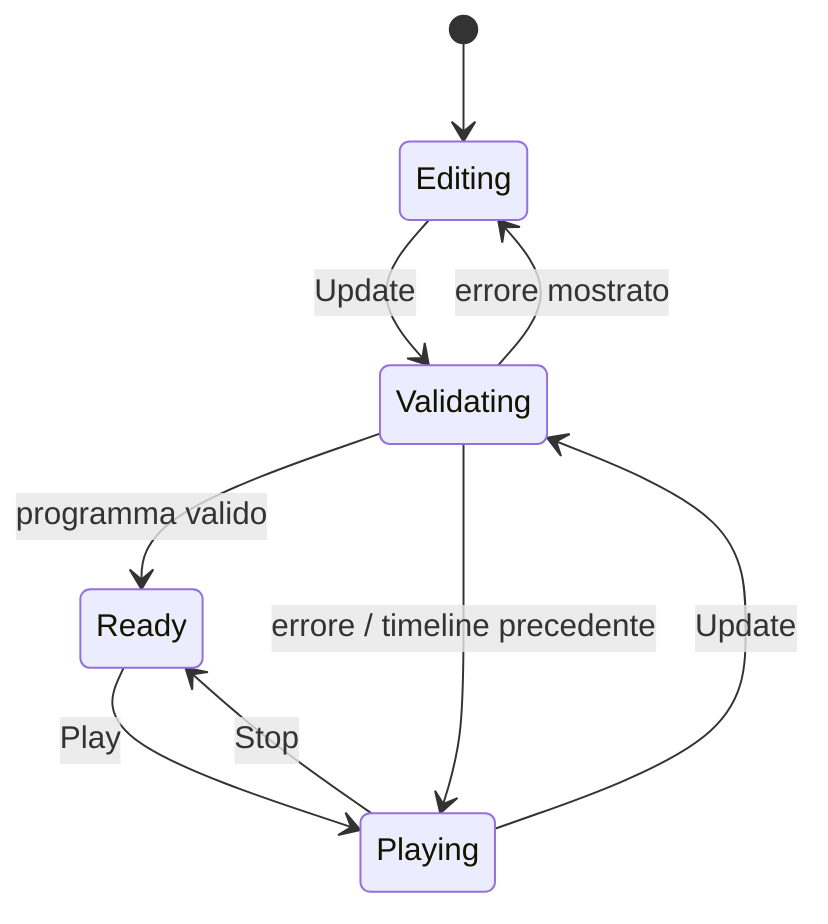

# Design di dettaglio

## Parser e interprete — Cristian Morbidelli

### Dalla sintassi alla semantica

Il sottosistema linguistico è diviso in due passaggi. Il **parser** riconosce la grammatica e produce un albero sintattico astratto (AST); l'**interprete** elimina i dettagli puramente grammaticali e costruisce pattern del dominio.

La separazione tra AST e dominio evita che l'engine debba conoscere parentesi, virgolette, nomi dei comandi o altre convenzioni testuali. Allo stesso tempo, l'AST conserva gli indici degli elementi nel sorgente: durante l'interpretazione tali coordinate vengono trasferite ai payload, consentendo alla UI di evidenziare ciò che è in riproduzione senza analizzare nuovamente il testo.

### Modello sintattico

Un programma è composto da stream. Ogni stream contiene:

- un generatore di note o suoni;
- una sequenza ordinata di estensioni;
- un'eventuale richiesta di visualizzazione.

I pattern sintattici rappresentano sequenze, sovrapposizioni, gruppi, alternanze e modificatori di velocità. Le trasformazioni sono modellate separatamente dai generatori, così il parser può verificare quali forme sono ammissibili in ogni punto della DSL.

### Regole di interpretazione

L'interprete applica le seguenti regole concettuali:

- una nota, una percussione o un silenzio diventa un atomo del dominio;
- elementi consecutivi diventano una sequenza;
- sequenze separate da virgole diventano livelli paralleli;
- gli elementi tra parentesi angolari diventano un'alternanza ciclica;
- le trasformazioni temporali avvolgono il pattern al quale si applicano;
- generatori aggiuntivi ed effetti diventano estensioni del pattern base;
- il comando di visualizzazione genera una richiesta associata allo stream, ma non modifica il suo contenuto musicale.

Il risultato dell'interpretazione è quindi una lista di pattern eseguibili e una lista indipendente di richieste grafiche. Un errore sintattico interrompe questa trasformazione e viene restituito al coordinamento applicativo; la timeline valida precedente può così rimanere invariata.

## Engine — Federico Morsucci

### Algebra dei pattern

Il nucleo dell'engine opera su un'algebra ricorsiva di pattern. I casi essenziali sono:

- **atomo**, che contiene un singolo valore;
- **sequenza**, che divide l'intervallo disponibile fra i figli;
- **parallelo**, che assegna lo stesso intervallo a più figli;
- **alternanza**, che sceglie il ramo in funzione del ciclo corrente;
- **estensione**, che associa al pattern principale effetti o configurazioni;
- **trasformazione temporale**, che modifica la collocazione o l'ordine degli eventi.

Questa rappresentazione esprime *che cosa* deve essere suonato senza fissare anticipatamente istanti reali o tecnologia audio. Inoltre permette di comporre i costrutti in modo uniforme: un pattern complesso è sempre ottenuto combinando pattern più piccoli.

### Risoluzione temporale

La risoluzione valuta un pattern rispetto a una finestra temporale espressa in cicli. Un dispatcher individua la natura del pattern e delega la regola temporale al resolver corrispondente. Tutti i resolver rispettano lo stesso contratto: ricevono un pattern e una finestra, restituiscono eventi collocati o intersecati con quella finestra.

Il tempo musicale è rappresentato con frazioni, evitando errori cumulativi quando intervalli e trasformazioni vengono composti. Ogni evento schedulato distingue:

- l'intervallo completo a cui appartiene;
- la porzione che cade nella finestra osservata;
- il payload da eseguire;
- le estensioni applicate.

La distinzione fra intervallo completo e porzione visibile è necessaria quando un evento attraversa il confine della finestra: la visualizzazione può mostrarne solo la parte pertinente, mentre la durata musicale resta quella originaria.

### Scheduling e riproduzione

Lo scheduler offre due viste dello stesso risultato. Le timeline finite coprono la lunghezza naturale dei pattern e sono adatte alle visualizzazioni; la timeline lazy genera invece i cicli progressivamente ed è adatta alla riproduzione continua senza materializzare una sequenza infinita.

Il player converte il tempo logico in millisecondi solo al confine con l'esecuzione. Durante la riproduzione consuma gli eventi maturi, li inoltra al backend audio e mantiene l'insieme delle posizioni sorgente attive. L'aggiornamento del programma sostituisce la timeline e ne reimposta il riferimento temporale; play e stop controllano il consumo della timeline senza coinvolgere parser e resolver.

## Audio e MIDI — Tommaso Remedi

### Separazione tra scheduling e produzione sonora

L'engine non invia direttamente messaggi MIDI. Il player comunica con un **backend audio** mediante eventi già risolti; il backend traduce invece payload ed estensioni in richieste sonore. Un ulteriore **motore audio** incapsula il sintetizzatore e il ciclo di vita delle sue risorse.

Questa doppia astrazione permette di provare la temporizzazione con un backend controllato e di provare la traduzione MIDI senza avviare l'intera applicazione.

### Traduzione musicale

Il backend distingue tre casi:

- le note vengono convertite in numeri MIDI e associate a uno strumento General MIDI;
- i nomi dei suoni percussivi vengono convertiti nelle note del canale percussionistico;
- i silenzi non producono comandi sonori.

Le estensioni udibili vengono trasformate in parametri della nota o controlli di canale. Il guadagno determina la velocity; pan, riverbero e filtro passa-basso sono approssimati tramite controlli MIDI. Gli effetti privi di una corrispondenza MIDI adeguata restano nel modello, senza introdurre dipendenze nell'engine.

I canali melodici sono assegnati per voce, dove una voce identifica una combinazione compatibile di strumento e controlli. In questo modo note simultanee con configurazioni diverse non si sovrascrivono a vicenda, mentre il canale General MIDI dedicato alle percussioni resta riservato.

L'avvio di una nota è immediato, mentre la sua terminazione è pianificata in modo non bloccante. Se il sintetizzatore non è disponibile, un motore silenzioso mantiene operativo il resto dell'applicazione: parsing, scheduling, interfaccia e test non dipendono quindi dalla presenza di un dispositivo audio.

## Interfaccia utente — Giacomo Biagioni

### Coordinamento tramite Model–View–Update

L'interfaccia è progettata attorno a un ciclo Model–View–Update. Lo stato applicativo comprende timeline finite, visualizzatori richiesti, errore corrente, stato di riproduzione e posizioni sorgente attive. Gli eventi dell'utente e le notifiche del player sono rappresentati come messaggi.

La funzione di aggiornamento decide la nuova versione del modello e descrive l'eventuale effetto da eseguire. Il runtime applica la transizione, richiede il rendering della vista ed esegue l'effetto. Gli effetti che producono un risultato rientrano nel ciclo come nuovi messaggi. In questo modo la vista non orchestra direttamente parser, scheduler o audio.

Una proprietà importante per il live coding è la gestione dell'errore: un programma non valido aggiorna il messaggio mostrato, ma non sostituisce la timeline valida già caricata. Un aggiornamento valido, invece, produce sia la timeline infinita per il player sia quelle finite necessarie alla rappresentazione grafica.

### Editor e feedback visivo

La vista principale compone tre responsabilità:

- l'editor acquisisce il programma e offre evidenziazione sintattica, completamento, auto-pairing, numeri di riga e scorciatoie;
- il banner presenta gli errori senza interrompere la sessione;
- i visualizzatori rappresentano l'evoluzione temporale degli stream richiesti.

Le posizioni sorgente costituiscono il collegamento fra riproduzione ed editor. Il player comunica l'insieme delle posizioni attive; il modello le registra e la vista le rende come evidenziazioni, senza dipendere dai dettagli dello scheduling.

I visualizzatori sono associati allo stream e ancorati alla posizione del relativo comando nel testo. Una revisione della timeline consente alla vista di distinguere un nuovo contenuto musicale da un semplice ridisegno. Il contratto comune di avvio e arresto mantiene inoltre sincronizzato il loro stato con quello della riproduzione, senza vincolare il coordinamento a una specifica rappresentazione grafica.

## Contratti tra i sottosistemi

| Confine | Dati scambiati | Vincolo di design |
|---|---|---|
| UI → parser | Testo completo del programma | Il parsing avviene solo su richiesta di aggiornamento. |
| Parser → interprete | AST e coordinate sorgente | L'AST non contiene decisioni di scheduling o dettagli MIDI. |
| Interprete → engine | Pattern e payload del dominio | Il dominio è indipendente dalla sintassi concreta. |
| Engine → audio | Evento, durata ed estensioni risolte | Il backend non conosce AST, editor o combinatori di pattern. |
| Engine → UI | Timeline finite e posizioni attive | La UI osserva risultati, ma non calcola la semantica temporale. |
| Runtime → vista | Stato applicativo completo | Il rendering deriva dal modello e non avvia direttamente effetti. |

Questi contratti limitano la propagazione dei cambiamenti: una nuova resa sonora richiede principalmente un adattamento del backend; un nuovo costrutto temporale interessa AST, interpretazione e relativo resolver; una nuova visualizzazione può consumare timeline esistenti senza modificare la produzione audio.
